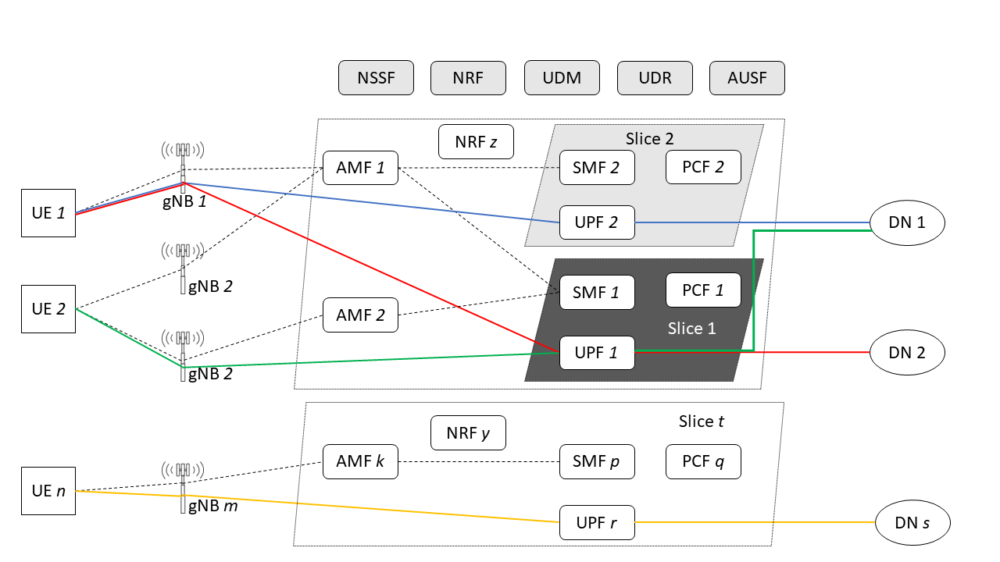
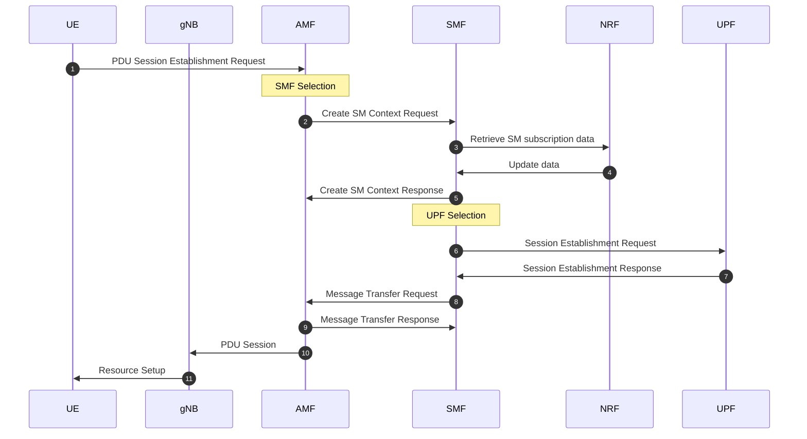
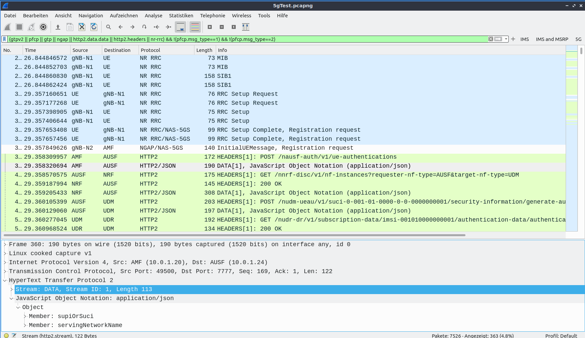

# Mobile Computing Project Description 2023/24

The Mobile Computing module consists of a project. 
The project is introduced in this document.

In case of questions or problems, a corresponding E-Mail 
including a detailed problem description that can be sent to 
[mobilecomputing@e-technik.org](mobilecomputing@e-technik.org)
In case of major difficulties, a meeting may be scheduled 
to explain the problem further. 
But please always try to solve the issues and research answers on your own first.

The project deals with implementing a 5G core, including Radio Access Networks (RANs), 
User Equipment (UEs), Data Networks (DNs), and Network Slicing. 
This will involve applying previously learned practices from other modules, 
such as Software Engineering, Cloud Computing, and Digital Switching and Routing. 
The general scope of the project is presented in more detail below, including the definition 
of the requirements and recommendations, as well as the submission and evaluation guidelines.

## Scope of the Project

A fundamental 5G design principle is the Service Based Architecture (SBA). It provides the basis for 
comprehensive modularization, which in turn is the prerequisite for being able to compile and combine 
network functions flexibly as required according to the use cases to be supported. 
In practical implementation, this requires using the design principle of network softwarization, i.e., 
the application of NFV (Network Functions Virtualisation) and SDN (Software-defined Networking) for 
the realization of Network Function instances and their interaction. 
If besides, the design principle of multi-tenant capability is to be implemented, network slicing will be useful. 
Here, two or more logical networks, parallel running network slices, are formed. 
They enable several tenants, e.g., a mobile network operator, a fixed network operator and 
an MVNO (Mobile Virtual Network Operator) for eMBB, a Smart Grid Provider and a service provider for 
autonomous vehicles for URLLC, in order to operate several logical communication networks with different 
characteristics in parallel on one physical network platform [1].

The task of this project consists of providing one or several services with specific functionality to different tenants.
To ensure the separation of the services and end-users, the concept of network slicing must be utilized. 
Furthermore, a set of RANs and possibly DNs are connected via slices. And last but not least the 5G core with its SBA 
has to be implemented, possibly with several network functions.

## Project Description

The target of the project is to implement a complete 5G environment consisting of multiple UEs, gNBs, NFs, network slices, DNs, and different applications.
The following list should give an overview:
- multiple UEs, e.g. possibly connectable to different gNBs and running different clients for different applications
- multiple gNBs, e.g. connecting several UEs
- multiple NFs, e.g. several AMFs, SMFs and UPFs
- multiple network slices, e.g. served by single UPF
- multiple DNs, with public IP addresses, which would also be valid in a real-world environment
- different applications, e.g. VoIP, file sharing, video streaming, chat, etc.
- only IPv4 addresses are allowed. DNs must have public IP addresses. 5G core has to use **Class B** IP addresses
- only 5G SA (standalone)
- use [UERANSIM](https://github.com/aligungr/UERANSIM) to implement the UEs and gNBs
- use [Open5GS](https://open5gs.org/) to implement the 5G core
- Linux use (no Windows-Subsystem for Linux!!!)

Furthermore, it is requested that the implemented environment is tested and analyzed. 
Therefore, it is helpful to depict for instance how a PDU session is established.
Diagrams such as Message Sequence Charts showing how and which messages will be exchanged between the involved NFs are requested.

#### MSC Example

You can render UML diagrams using [Mermaid](https://mermaidjs.github.io/). For example, this will produce a sequence diagram:

Also supporting Wireshark traces will help to prove that you really did the tests on your own.

#### Wireshark Trace Example

Describe what you have implemented. Give an overview and understandable description of what you have realized and how others may reconstruct your work.

## References

[1]: Trick, U., 2021. 5G - An Introduction to the 5th Generation Mobile Networks. De Gruyter STEM Hrsg. Berlin/München/Boston: De Gruyter Oldenbourg.
