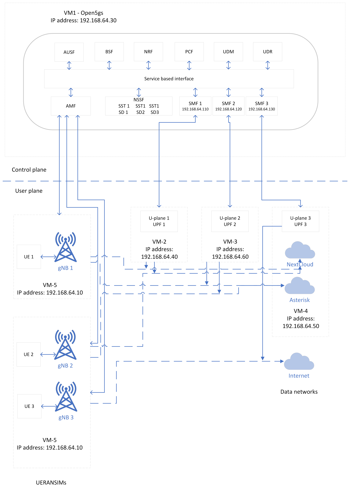

[](https://classroom.github.com/a/qFG2YiDH)
[](https://classroom.github.com/open-in-codespaces?assignment_repo_id=13139491)
# Mobile Computing project README

<!-- University LOGO -->


<h1 align="center">team_entropy</h1>
<p align="center">
    <strong>Open5gs and UERANSIM, services: VoIP, File sharing, Streaming</strong>
    <br>
    team_entropy
    <br>
    Kushal Prakash 1429800  <br>
    Karthik Kothamangala Sreenath 1438341 <br>
    Padmini Manjunatha 1427336 <br>
    Madhushree Manjunatha Lakshmidevi 1445185 <br>
    <br>
    Guidance <br>
    Prof. Dr. Armin Lehmann <br>
    Prof. Gregor Frick
    <br>
</p>
<br/>


## Contents

*   [Acknowledgement](#acknowledgement)
*   [Project Planning Essentials](https://github.com/FRA-UAS/mobcomwise23-24-team_entropy/blob/main/documentation/ProjectPlan.md)
*   [Creation of NAT network](https://github.com/FRA-UAS/mobcomwise23-24-team_entropy/blob/main/documentation/Creating_NAT_in_Virtualbox.md)
*   [Acknowledgement](#acknowledgement)
*   [Abstract](#abstract)
*   [Definations and Abrrevations](#definition-and-abbreviations)
*   [Introduction](#introduction)
    * [Overview on open5gs](#overview-on-5g)
    * [User Equipments UEs](#user-equipements-ues)
    * [Next Generation NodeB - gNB](#gnbs)
*   [Network Functions - NFs](#network-functions-nfs)
*   [Network Slicing](#network-slicing)
*   [Open5gs Network Architecture](#open5gs-network-architecture)
*   [Services](#services)
    * [VOiP](#voip)
    * [File Transfer](#file-transfer)
    * [Video Streaming](#video-streaming)
*   [Technologies Used](https://github.com/FRA-UAS/mobcomwise23-24-team_entropy/blob/main/documentation/Technologies%20Used.md)
*   [Contribute](#contribute)
*   [License](#license)
*   [Sources](#sources)
*   [Conclusion](#conclusion)

## Acknowledgement

This project owes its successful completion to the invaluable assistance provided by Professor Dr. Armin Lehmann and Professor Ulrich Trick from Frankfurt University of Applied Sciences. Throughout the project's execution, their guidance and support were instrumental, playing a crucial role in helping us achieve our objectives. We are sincerely grateful to them for serving as our project mentors, imparting the knowledge and direction necessary for the project's successful culmination.


## Abstract

Compared to 4G network 5G offers high speed data rates and connectivity even during huge user volume. Along with this there are a variety of other applications supported by 5G network. The goal of a network slicing design for a 5G network is to increase network flexibility and dynamics to accommodate contemporary network applications. In this project, we have implemented a 5G Stand Alone (SA) network using Open5gs as a 5G core and UERANSIM as 5G-RAN. The main objective of this project is to implement network slicing to provide File Sharing, Streaming and VOIP calling services between two tenant groups. We configured Kamailio, Next Cloud and Owncast servers in different Vms to provide VOIP Calling, File Sharing and Streaming services respectively. The tenant groups were able to access the services using the dedicated slices as per their requirements.

## Introduction

The fundamental architectural concepts and technological advancements of 5G distinguish it from earlier generations of mobile communication networks. Key elements like network slicing and CUPS play pivotal roles in realizing the separation of control and user planes. Additionally, through network slicing, multiple logical (virtual) networks can be established on the same physical infrastructure to cater to diverse consumers and services. To implement the principles of CUPS and Network Slicing in the 5G network, it is essential to integrate Network Function Virtualization, Software Defined Networking, and Cloud-Native technologies into the core network design. These technologies are aimed at enhancing the adaptability, scalability, and flexibility of the 5G core network.

## Scope of the project

The aim of this project is to construct a 5G-SA (Stand-alone) system utilizing Open5GS, capable of delivering diverse services between hosts and segmenting the data network accordingly. This endeavor is executed through UERANSIM. The concept is anticipated to be effective as it enables SIP sessions, file sharing, and streaming among designated hosts within each network slice, while restricting communication between servers in distinct network slices.

## Definition and Abbreviations

5G SA                         5G Stand Alone
AMF                           Access and Mobility Management Function
5QI                           5G QoS Identifier
NRF                           Network Repository Function
UE                            User Equipment
NSSF                          Network Slice Selection Function
PDU                           Protocol Data Unit
NGAP                          Next Generation Application Protocol
SMF                           Session Management Function
SD                            Slice Differentiator
SST                           Slice/Service Type
SDN                           Software Defined Network
UPF                           User Plane Function
RAN                           Radio Access Network
PCF                           Policy Control Function
VOIP                          Voice Over Internet Protocol


## Overview on 5G

5G, the latest mobile telecommunications standard succeeding 4G/LTE, brings significant advancements in speed, capacity, and connectivity. 5G offers peak data rates reaching several gigabits per second, enabling faster downloads and improved network performance. With latency reduced to a few milliseconds, 5G supports real-time applications like AR, VR, and autonomous vehicles. 5G networks can handle more connected devices per area, crucial for IoT expansion. Operators can create virtualized network slices tailored to specific use cases such as enhanced mobile broadband, IoT, and low-latency communication. Advanced antenna technology like Massive MIMO improves spectral efficiency and data throughput. Leveraging high-band mmWave spectrum for faster data transfer, though requiring careful deployment due to shorter range. 5G incorporates encryption, authentication, and privacy features to protect user data and network integrity. Following 3GPP standards ensures interoperability across vendors and operators. Open5GS is an open-source project implementing network functions including AMF, SMF, PCF, UDM, AUSF, NRF, NSSF, UDR, and UPF. It facilitates the implementation of 5G SA networks with modular and scalable architecture. 

## UERANSIM

UERANSIM is an open-source tool designed to simulate the behavior of 5G User Equipment (UE) in both Standalone (SA) and Non-Standalone (NSA) modes. It offers developers the capability to emulate 5G UE functionality within a controlled environment, enabling testing and experimentation with 5G networks without the necessity for physical devices. UERANSIM supports a range of essential features found in 5G networks, including registration procedures, mobility management, bearer establishment, and data transfer. Its flexibility and extensibility make it a valuable resource for network development, testing, and research endeavors within the 5G domain. 
UE:  User Equipment
RAN: Radio Access Network
SIM: Simulator


## User Equipements (UEs)

The User Equipment (UE) in a 5G network comprises devices like smartphones, tablets, and IoT gadgets that connect to the 5G infrastructure for communication services. It initiates and maintains connections with the network, interacting with various network functions like Access and Mobility Management, Session Management, and User Plane functions. The UE is vital for achieving 5G's high data rates, low latency, and support for numerous connected devices. Advanced features like improved antennas and compatibility with diverse spectrum bands enhance connectivity and user experience in the 5G network.

## gNBs

The gNB, or gNodeB, is a core component of the 5G radio access network, serving as the base station connecting User Equipment to the 5G core network. It manages radio transmission and reception, allocates radio resources, and enables wireless communication with UEs using advanced technologies like Massive MIMO and beamforming. The gNB plays a crucial role in delivering high data rates, low latency, and improved connectivity in 5G networks. It communicates with the core network elements to establish and maintain connections, contributing to the scalability, flexibility, and efficiency of 5G networks across various use cases.

## Network Functions (NFs)

Network Functions (NFs) in a 5G architecture are software components responsible for specific tasks within the network. They include entities like Access and Mobility Management, Session Management, User Plane, Network Repository, Network Slice Selection, Authentication Server, Unified Data Management, Unified Data Repository, Policy Control, and Unified Data Storage Functions. Each NF performs specialized roles such as access management, session handling, user authentication, data storage, policy enforcement, and network slicing support. The collaboration of these NFs enables the delivery of high-performance, low-latency, and scalable 5G services across diverse applications and use cases, defining the functionality and capabilities of the 5G network architecture.

## Network Slicing

Network Slicing is a key concept in 5G networks, enabling the creation of customized virtual networks, known as network slices, tailored to specific use cases. These slices cater to different service characteristics like enhanced mobile broadband, massive machine-type communication, or ultra-reliable low-latency communication. The Network Slice Selection Function selects and activates the appropriate slice based on user requirements. Network slices optimize resource sharing and operate independently with unique configurations and policies. This flexibility allows 5G networks to support diverse services, applications, and industries simultaneously, meeting the connectivity needs of various users and devices.

## Data Network (DN)

The Data Network (DN) in 5G architecture manages data traffic between User Equipment and external networks like the internet. It incorporates components such as the User Plane Function (UPF), facilitating data transmission with efficiency and low latency. The DN enhances data rates, connectivity, and the handling of diverse data types, bolstering 5G networks for advanced communication services and diverse applications.


## Design and Implementation

1. *Linux Based Virtual Machine*: The basic setup includes installing Oracle VM VirtualBox (version 7.0), a platform-agnostic virtualization tool that allows users to run multiple operating systems simultaneously. During installation, the Ubuntu 20.04 ISO file is utilized to configure the system.

2. *Asterisk*: For SIP VoIP Calling, Asterisk is installed in the system. Version 18 of Asterisk is supported. This feature will provide a calling service for the desired network slice.

3. *Twinkle*: To support VoIP calls, the Twinkle software package version 1.10.1 is installed on end users' systems. This feature enables VoIP calling functionalities.

4. *Wireshark*: For traffic collecting and analysis, Wireshark version 3.2.3 is installed as a packet capture tool. This version of Wireshark provides the necessary functionalities for capturing and analyzing network traffic.

5. *Owncast*: To enable video streaming services, owncast version 0.0.13 is installed and facilitates the setup and management of video streaming capabilities.

6. *NextCloud*: To establish a file sharing platform, Nextcloud version 23.0.0 is installed. This provides the necessary features for hosting and managing file sharing services.

7. *Open5gs*: To establish the 5G core part in this project, Open5GS version 2.5.8 is installed, serving as the control plane of the 5G core network. 

8. *UERANSIM*: UERANSIM version 3.2.6 is downloaded, which includes multiple User Equipment (UEs) and gNodeBs. 

## Open5gs Network Architecture 
The architecture of open5gs is structured to adhere to 3GPP (3rd Generation Partnership Project) standard for 5G network.



The presented architecture provides an in-depth analysis of the architecture of a 5G network, outlining the various components deployed across the Control Plane and User Plane. The architecture is designed to support advanced functionalities such as network slicing, efficient data transmission, and the delivery of diverse services including File Sharing and VoIP Calling. The Control Plane comprises several critical functions responsible for managing network resources and controlling network operations. These functions include:
1. *Authentication Server Function (AUSF)*: AUSF authenticates and authorizes users accessing the network, ensuring secure access to network services.
2. *Bootstrap Function (BSF)*: BSF facilitates the bootstrapping process for User Equipments (UEs), enabling them to establish connections with the network.
3. *Network Repository Function (NRF)*: NRF acts as a repository for network function information, enabling efficient network function discovery and selection.
4. *Policy Control Function (PCF)*: PCF enforces network policies and rules, ensuring Quality of Service (QoS) and prioritizing traffic based on predefined policies.
5. *Unified Data Management (UDM) and Unified Data Repository (UDR)*: UDM and UDR store user-related data and subscription information, facilitating seamless user authentication and authorization processes.
6. *Authentication Management Function (AMF)*: AMF manages authentication procedures and mobility management, ensuring smooth handovers and continuity of service.
7. *Network Slice Selection Function (NSSF)*: NSSF orchestrates network slicing, dividing the network into multiple virtualized slices optimized for specific use cases or applications. Multiple instances of NSSF (SST1 - SD1, SST1 - SD2, SST1 - SD3) are deployed to support diverse slicing requirements.

The User Plane is responsible for handling data transmission and forwarding between User Equipments (UEs) and external networks. Key components in the User Plane include:
1. *User Equipments (UEs)*: UE1, UE2, and UE3 are endpoints that access network services and communicate with the network infrastructure.
2. *User Plane Function (UPF)*: UPF instances (UPF1, UPF2, UPF3) manage data forwarding and processing within the User Plane, ensuring efficient delivery of data packets to their intended destinations.
3. *Session Management Function (SMF)*: SMF instances (SMF1, SMF2, SMF3) handle session establishment and management, maintaining session states and ensuring seamless connectivity for UEs.

The Data Network hosts servers responsible for delivering specific services to users. Notable servers include:

1. *NextCloud Server*: The NextCloud server, installed in the Data Network, provides File Sharing services to UEs, enabling users to store, access, and share files securely.
2. *Asterisk Server*: The Asterisk server, also located in the Data Network, facilitates VoIP Calling services, allowing users to make voice calls over the IP network.
3. *Twinkle Service*: Additionally, the Twinkle service, integrated into the Data Network, enhances communication capabilities by enabling Voice over IP (VoIP) calls, text messaging, and other multimedia communication features. Twinkle serves as a versatile client software package, complementing the Asterisk server to provide seamless VoIP calling functionalities within the network.

The architecture of the 5G network demonstrates a robust framework designed to support advanced communication services and accommodate the diverse needs of users. By deploying a comprehensive set of Control Plane and User Plane components, along with dedicated service servers, the network architecture ensures efficient data transmission, seamless connectivity, and reliable service delivery. Continued optimization and enhancements to the architecture will further enhance its scalability, reliability, and performance, paving the way for the future of 5G communication.


## Implementation

1. [Installation on Mac](https://github.com/FRA-UAS/mobcomwise23-24-team_entropy/blob/main/documentation/Install_Ubuntu_on_Mac.md): This section of the report will cover the process of installing the specified software or application on the macOS operating system. It will detail the steps involved in downloading the necessary installation files, navigating through the installation wizard, and configuring any settings required for successful installation. Additionally, it may include troubleshooting tips for common installation issues on Mac computers.

2. [Installation on Windows](https://github.com/FRA-UAS/mobcomwise23-24-team_entropy/blob/main/documentation/Install_Ubuntu_on_Windows.md): The report's part on installation instructions for the mentioned program or application on Windows will go into detail. It will contain instructions on how to obtain the installation files, carry out the installation, and modify the software settings as needed. Furthermore, compatibility problems specific to the Windows operating system will be discussed, along with possible workarounds.

3. [Installation of Open5GS and UERANSIM](https://github.com/FRA-UAS/mobcomwise23-24-team_entropy/blob/main/documentation/Installation%20of%20Open5gs%20and%20UERANSIM.md):
The installation of Open5GS and UERANSIM, two specialized software components linked to the infrastructure of the 5G network, will be the subject of this report's section. It will go through the procedures needed to install these parts on an appropriate operating system, like Ubuntu or Linux, including downloading the essential files, setting up dependencies, and starting the application. For testing and development reasons, it might also contain instructions on how to integrate Open5GS and UERANSIM with other network components.

### Configuration File Setup and Status Checking

After configuring the AMF and SMF files, four NSSF configuration files were created to align with the project requirements, each tailored for specific SST and SD combinations. A screenshot of one of the NSSF files displaying the edited IP address, SST, and SD values is provided, with similar adjustments made to the other NSSF files.

Following the completion of Open5GS installation, the status of the AMF and SMF files was verified to ensure they were operational before proceeding with further configurations. The following commands were utilized to check the status of the AMF and SMF files:

``` 
    sudo service open5gs-amfd status
    sudo service open5gs-smfd status
```
### Register UE Device

Open5GS provides a WebUI application accessible through a web browser. To access this interface, we installed the Firefox browser and connected to the WebUI within the container session. The WebUI can be accessed using the following URL: http://localhost:9000. After connecting to the WebUI, we added new subscribers for different slices, as shown in the provided screenshots. The configuration of one UE is depicted below, with similar configurations applied to all other UEs for each SST/SD combination.

Fig: WEBUI with one subscriber detail
Fig: WEBUI with four subscriber (UE)

### Establishment of User Planes for SST1 and SST2
### UERANSIM Configuration: gNodeB and UEs

## Services

### VoIP (Voice over Internet Protocol)

Voice over IP (VoIP) revolutionizes communication by enabling voice calls over the internet, offering cost-effective communication, seamless integration with internet services, and features like video calls and instant messaging. Asterisk serves as the central server, orchestrating call routing, security, and other functions, while Linphone serves as client software, enabling users to make and receive calls, video calls, and instant messages using Asterisk's services. Together, Asterisk and Twinkle make VoIP a reality, ensuring smooth and secure communication. Additionally, Asterisk supports SIP-based applications beyond calling, while Linphone offers various plugins for customization and features. This overview provides insight into how these components collaborate to deliver internet-based communication, with active communities available for further guidance.

### Asterisk and Twinkle Configuration: 

To utilize VoIP service, a call server is established with the Asterisk package. Asterisk serves as the "Call Server" and utilizes the MariaDB database server for authentication, a provision available within Asterisk. The protocol employed for VoIP communication is SIP (Session Initiation Protocol). User registration is facilitated through the 'Twinkle' application. Each host (UE) configured with slice SST2, SD1, and SST2, SD2 for VoIP services is equipped with the Twinkle package. The users created in the database are then registered on each host using Twinkle to enable call placement after establishing the PDU Session via the uesimtun0 interface using the nr-binder tool of UERANSIM.

Installation of Asterisk and Twinkle: 

```
```
Fig: of Asterisk and twinkle with db show 

On system startup, Kamailio requires manual initiation. The 'Zoiper' softphone was installed on the User Equipments by downloading the software package from its official website. Subsequently, the zipped package was extracted, and the application was launched using the relevant commands.
```
```

## File transfer

File transfer is crucial in digital communication, allowing seamless sharing of files via methods like email, USB drives, and network protocols. Nextcloud, a popular cloud-based file-sharing system, offers a secure platform for users to upload, organize, and share files. It provides features such as share links, user accounts, and real-time collaboration, with installation packages available for different operating systems. Nextcloud's user-friendly web interface simplifies file management and collaboration, making it ideal for various environments. It offers customizable configurations for enterprise-level collaboration or personal usage, enabling secure and efficient data transmission.

### Nextcloud: Secure File Sharing and Collaboration Platform
Nextcloud has been installed on the system to facilitate seamless file sharing among users. Additionally, the Firefox browser has been installed within the LXC environment to configure both the admin and user profiles within the Nextcloud server. To access the Nextcloud server admin interface, users can navigate to the following URL: , where the IP address 10.167.53.194 corresponds to the LXC named 'nextcloud' housing the Nextcloud server installation. Upon registration as an admin in Nextcloud, two user profiles are created to enable access to file sharing services for the two User Equipments, each assigned to slices SST1, SD1 and SST1, SD2 respectively.

Installation and setup of NextCloud: 

```
```
 

## Video streaming

To establish the video streaming service, Owncast and Firefox browser were installed. Owncast was configured via its admin interface. Open Broadcaster Software (OBS) Studio was installed on User Equipment (UE) for broadcasting video. OBS enables recording and streaming of audio-visual content.

### Video streaming with OWNCAST:

To initiate the video streaming service, Owncast is installed on the system. Following this, the Firefox browser is installed to configure the admin interface of the Owncast server. To verify the installation, we access the default page using the server's IP address at port xxxx:. Subsequently, the Owncast configuration is performed by logging into the /admin backend dashboard via port xxx: .

For connecting the Open Broadcaster Software (OBS) Studio installed on the User Equipment to the Owncast Server, OBS Studio, an open-source software for recording and live streaming, is installed on the User Equipment designated as 'ue1.' This User Equipment is dedicated to the slice with SST 1, SD 1, and is configured to broadcast video on a TUN interface after establishing a PDU session via the 5G Core. OBS Studio installation and configuration on the broadcasting User Equipment are completed using the provided commands.

Once OBS Studio is set up, the broadcasting User Equipment can start streaming using the uesimtun0 interface through the nr-binder tool of UERANSIM.
```
```


### Testing

Below are some of the tests we performed both to test the feature and to see the failure points.

## Running the 5G Network

## Network Slicing

## DDOS attack on the network
By using many UEs to connect with the network at once in loop we can over load the tower to crash it, also given the low system specification, we can achieve it sooner.

### Logging

Logging is essential. How do you know something went wrong if the computer doesn't tell you? Logs
are the first place to search for bugs. Explain to everybody how you can customize it or used it
in the right way.

## Contribute

Pull requests are welcome. For major changes, please open an issue first to discuss what you would like to change.

Please make sure to update tests as appropriate.

## License
[MIT](https://choosealicense.com/licenses/mit/)

## Sources

1. 	5G : an introduction to the 5th generation mobile networks / Ulrich Trick https://hds.hebis.de/fuas/Record/HEB476048613
2. 	5G for the connected world https://hds.hebis.de/fuas/Record/HEB450285588
3. 	5G technology : 3GPP new radio / edited by Harri Holma and Antti Toskala (Nokia Siemens Networks, Finland), Takehiro Nakamura (5G Laboratories, NTT DOCOMO, Inc., Japan) https://hds.hebis.de/fuas/Record/HEB458457841
4. 	https://github.com/open5gs/open5gs/discussions/2782#discussioncomment-8070985
5. 	https://open5gs.org/open5gs/docs/guide/01-quickstart/
6. 	https://open5gs.org/open5gs/docs/guide/02-building-open5gs-from-sources/
7. 	https://github.com/aligungr/UERANSIM/wiki/Installation
8. 	https://free5gc.org/guide/2-config-vm-en/
9. 	https://docs.nextcloud.com/server/latest/admin_manual/installation/example_ubuntu.html
10. https://github.com/s5uishida/open5gs_5gc_ueransim_sample_config
11. https://github.com/s5uishida/open5gs_5gc_ueransim_nearby_upf_sample_config
12. https://open5gs.org/open5gs/docs/tutorial/04-metrics-prometheus/

[react-markdown][react-markdown] - Project which served as an inspiration for this README

[Blog post templates][blog-post-templates] - Used to structure this template as an easy to read blog post

[About markdown][about-markdown] - Why should you use markdown?

[Markdown Cheat Sheet][markdown-cheatsheet] - Get a fast overview of the syntax

[//]: # "Source definitions"
[react-markdown]: https://github.com/remarkjs/react-markdown "React-markdown project"
[blog-post-templates]: https://backlinko.com/hub/content/blog-post-templates "Backlinko blog post templates"
[about-markdown]: https://www.markdownguide.org/getting-started/ "Introduction to markdown"
[markdown-cheatsheet]: https://www.markdownguide.org/cheat-sheet/ "Markdown Cheat Sheet"

## Conclusion

To summarize..

We have an exhaustive README template with many features. The README is easy to read and navigate like an article.
In our future projects we can use this template to get a great head start in creating a custom README.
