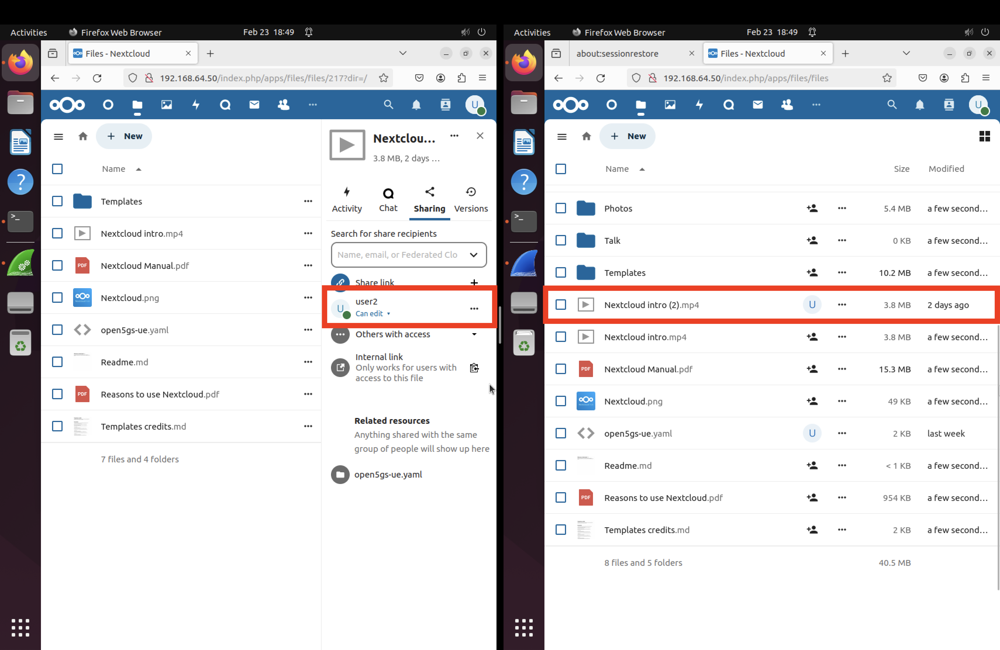
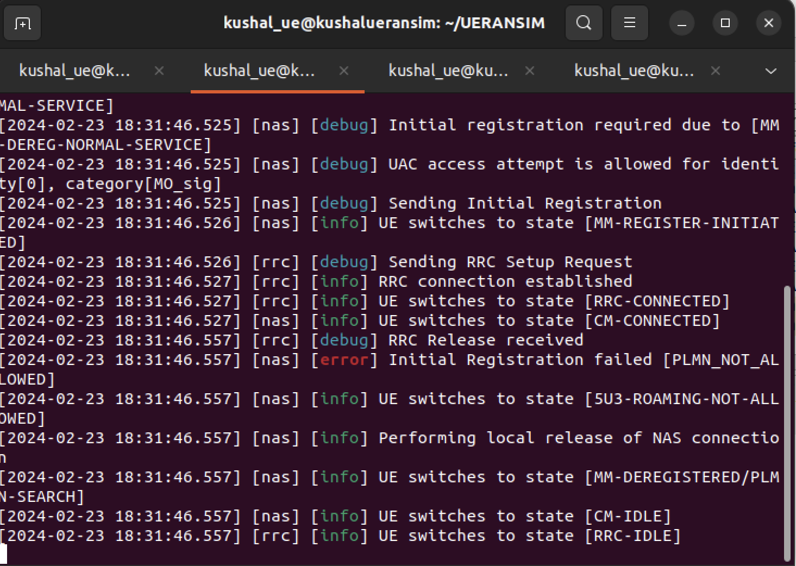

[](https://classroom.github.com/a/qFG2YiDH)
[](https://classroom.github.com/open-in-codespaces?assignment_repo_id=13139491)
# Mobile Computing project README

<!-- University LOGO -->


<h1 align="center">team_entropy</h1>
<p align="center">
    <strong>Open5gs and UERANSIM, services: VoIP, File sharing, Streaming</strong>
    <br>
    team_entropy
    <br>
    Kushal Prakash 1429800  <br>
    Karthik Kothamangala Sreenath 1438341 <br>
    Padmini Manjunatha 1427336 <br>
    Madhushree Manjunatha Lakshmidevi 1445185 <br>
    <br>
    Guidance <br>
    Prof. Dr. Armin Lehmann <br>
    Prof. Gregor Frick
    <br>
</p>
<br/>


## Contents

1. [Acknowledgement](#acknowledgement)
2. [Abstract](#abstract)
3. [Introduction](#introduction)
4. [Scope of the Project](#scope-of-the-project)
5. [Definitions and Abbreviations](#definition-and-abbreviations)
6. [Overview on 5G](#overview-on-5g)
7. [UERANSIM](#ueransim)
8. [User Equipments (UEs)](#user-equipements-ues)
9. [gNBs](#gnbs)
10. [Network Functions (NFs)](#network-functions-nfs)
11. [Network Slicing](#network-slicing)
12. [Data Network (DN)](#data-network-dn)
13. [Design and Implementation](#design-and-implementation)
14. [Open5gs Network Architecture](#open5gs-network-architecture)
15. [Implementation](#implementation)
    - [Installations](#installations)
    - [Configuration File Setup and Status Checking](#configuration-file-setup-and-status-checking)
    - [Register UE Device](#register-ue-device)
    - [Establishment of User Planes](#establishment-of-user-planes-for-sst1-and-sd1-sd2-and-sd3)
    - [UERANSIM Configuration](#ueransim-configuration-gnodeb-and-ues)
16. [Services](#services)
    - [VoIP (Voice over Internet Protocol)](#video-streaming)
    - [File Transfer](#file-transfer)
    - [Video Streaming](#video-streaming)
17. [Running the 5G Network](#running-the-5g-network)
18. [Network Slicing](#network-slicing)
19. [Commands Used](#commands-that-are-used)
20. [DDOS Attack on the Network](#ddos-attack-on-the-network)
21. [Logging](#logging)
22. [Testing](#testing)
23. [Contribution](#contribute)
24. [License](#license)
25. [Sources](#sources)
26. [Conclusion](#conclusion)


## Acknowledgement

This project owes its successful completion to the invaluable assistance provided by Professor Dr. Armin Lehmann and Gergor Frick from Frankfurt University of Applied Sciences. Throughout the project's execution, their guidance and support were instrumental, playing a crucial role in helping us achieve our objectives. We are sincerely grateful to them for serving as our project mentors, imparting the knowledge and direction necessary for the project's successful culmination.


## Abstract

Compared to 4G network 5G offers high speed data rates and connectivity even during huge user volume. Along with this there are a variety of other applications supported by 5G network. The goal of a network slicing design for a 5G network is to increase network flexibility and dynamics to accommodate contemporary network applications. In this project, we have implemented a 5G Stand Alone (SA) network using Open5gs as a 5G core and UERANSIM as 5G-RAN. The main objective of this project is to implement network slicing to provide intertnet connection, File Sharing, Streaming and VoIP calling services between two tenant groups. We configured Asterisk, Next Cloud and Owncast servers in different Vms to provide VoIP Calling, File Sharing and Streaming services respectively. The tenant groups were able to access the services using the dedicated slices as per their requirements.

## Introduction

The fundamental architectural concepts and technological advancements of 5G distinguish it from earlier generations of mobile communication networks. Key elements like network slicing and CUPS play pivotal roles in realizing the separation of control and user planes. Additionally, through network slicing, multiple logical (virtual) networks can be established on the same physical infrastructure to cater to diverse consumers and services. To implement the principles of CUPS and Network Slicing in the 5G network, it is essential to integrate Network Function Virtualization, Software Defined Networking, and Cloud-Native technologies into the core network design. These technologies are aimed at enhancing the adaptability, scalability, and flexibility of the 5G core network.

## Scope of the project

The aim of this project is to construct a 5G-SA (Stand-alone) system utilizing Open5gs, capable of delivering diverse services between hosts and segmenting the data network accordingly. This endeavor is executed through UERANSIM. The concept is anticipated to be effective as it enables SIP sessions, file sharing, and streaming among designated hosts within each network slice.

## Definition and Abbreviations

VM                            Virtual Machine
5G SA                         5G Stand Alone
AMF                           Access and Mobility Management Function
5QI                           5G QoS Identifier
NRF                           Network Repository Function
UE                            User Equipment
NSSF                          Network Slice Selection Function
PDU                           Protocol Data Unit
NGAP                          Next Generation Application Protocol
SMF                           Session Management Function
SD                            Slice Differentiator
SST                           Slice/Service Type
SDN                           Software Defined Network
UPF                           User Plane Function
RAN                           Radio Access Network
PCF                           Policy Control Function
VOIP                          Voice Over Internet Protocol
SST                           Service Set Type 
SD                            Service Domains
SIP                           Session Initiation Protocol
UDM	                          Unified Data Management
AUSF	                      Authentication Server Function
UDR	                          Unified Data Repository


## Overview on 5G and Open5gs

5G, the latest mobile telecommunications standard succeeding 4G/LTE, brings significant advancements in speed, capacity, and connectivity. 5G offers peak data rates reaching several gigabits per second, enabling faster downloads and improved network performance. With latency reduced to a few milliseconds, 5G supports real-time applications like AR, VR, and autonomous vehicles. 5G networks can handle more connected devices per area, crucial for IoT expansion. Operators can create virtualized network slices tailored to specific use cases such as enhanced mobile broadband, IoT, and low-latency communication. Advanced antenna technology like Massive MIMO improves spectral efficiency and data throughput. Leveraging high-band milimeter wave spectrum for faster data transfer, though requiring careful deployment due to shorter range. 5G incorporates encryption, authentication, and privacy features to protect user data and network integrity. Following 3GPP standards ensures interoperability across vendors and operators. Open5GS is an open-source project implementing network functions including AMF, SMF, PCF, UDM, AUSF, NRF, NSSF, UDR, and UPF. It facilitates the implementation of 5G SA networks with modular and scalable architecture. 

## UERANSIM

UERANSIM is an open-source tool designed to simulate the behavior of 5G User Equipment in both Standalone and Non-Standalone (NSA) modes. It offers developers the capability to emulate 5G UE functionality within a controlled environment, enabling testing and experimentation with 5G networks without the necessity for physical devices. UERANSIM supports a range of essential features found in 5G networks, including registration procedures, mobility management, bearer establishment, and data transfer. Its flexibility and extensibility make it a valuable resource for network development, testing, and research endeavors within the 5G domain. 
UE:  User Equipment
RAN: Radio Access Network
SIM: Simulator


## User Equipements (UEs)

The User Equipment in a 5G network comprises devices like smartphones, tablets, and IoT gadgets that connect to the 5G infrastructure for communication services. It initiates and maintains connections with the network, interacting with various network functions like Access and Mobility Management, Session Management, and User Plane functions. The UE is vital for achieving 5G's high data rates, low latency, and support for numerous connected devices. Advanced features like improved antennas and compatibility with diverse spectrum bands enhance connectivity and user experience in the 5G network.

## gNBs

The gNB, or gNodeB, is a core component of the 5G radio access network, serving as the base station connecting User Equipment to the 5G core network. It manages radio transmission and reception, allocates radio resources, and enables wireless communication with UEs using advanced technologies like Massive MIMO and beamforming. The gNB plays a crucial role in delivering high data rates, low latency, and improved connectivity in 5G networks. It communicates with the core network elements to establish and maintain connections, contributing to the scalability, flexibility, and efficiency of 5G networks across various use cases.

## Network Functions (NFs)

Network Functions (NFs) in a 5G architecture are software components responsible for specific tasks within the network. They include entities like Access and Mobility Management, Session Management, User Plane, Network Repository, Network Slice Selection, Authentication Server, Unified Data Management, Unified Data Repository, Policy Control, and Unified Data Storage Functions. Each NF performs specialized roles such as access management, session handling, user authentication, data storage, policy enforcement, and network slicing support. The collaboration of these NFs enables the delivery of high-performance, low-latency, and scalable 5G services across diverse applications and use cases, defining the functionality and capabilities of the 5G network architecture.

## Network Slicing

Network Slicing is a key concept in 5G networks, enabling the creation of customized virtual networks, known as network slices, tailored to specific use cases. These slices cater to different service characteristics like enhanced mobile broadband, massive machine-type communication, or ultra-reliable low-latency communication. The Network Slice Selection Function selects and activates the appropriate slice based on user requirements. Network slices optimize resource sharing and operate independently with unique configurations and policies. This flexibility allows 5G networks to support diverse services, applications, and industries simultaneously, meeting the connectivity needs of various users and devices.

## Data Network (DN)

The Data Network in 5G architecture manages data traffic between User Equipment and external networks like the internet. It incorporates components such as the User Plane Function (UPF), facilitating data transmission with efficiency and low latency. The DN enhances data rates, connectivity, and the handling of diverse data types, bolstering 5G networks for advanced communication services and diverse applications.

## VoIP (Voice over Internet Protocol) using Asterisk

Voice over IP revolutionizes communication by enabling voice calls over the internet, offering cost-effective communication, seamless integration with internet services, and features like video calls and instant messaging. Asterisk serves as the central server, orchestrating call routing, security, and other functions, while Linphone serves as client software, enabling users to make and receive calls and instant messages using Asterisk's services. Together, Asterisk and Twinkle make VoIP a reality, ensuring smooth and secure communication. Additionally, Asterisk supports SIP-based applications beyond calling, while Twinkle offers various plugins for customization and features. This overview provides insight into how these components collaborate to deliver internet-based communication, with active communities available for further guidance.

## File sharing using Nextcloud: Secure File Sharing and Collaboration Platform

File transfer is crucial in digital communication, allowing seamless sharing of files via methods like email, USB drives, and network protocols. Nextcloud, a popular cloud-based file-sharing system, offers a secure platform for users to upload, organize, and share files. It provides features such as share links, user accounts, and real-time collaboration, with installation packages available for different operating systems. Nextcloud's user-friendly web interface simplifies file management and collaboration, making it ideal for various environments. It offers customizable configurations for enterprise-level collaboration or personal usage, enabling secure and efficient data transmission.
Nextcloud has been installed on the system to facilitate seamless file sharing among users. Additionally, the Firefox browser has been installed in VM to configure both the admin and user profiles within the Nextcloud server. To access the Nextcloud server admin interface, users can navigate to the following URL in the VM where the server is installed : 192.168.64.50 , where the IP address 192.168.64.50 corresponds to the VM named 'upf-3' housing the Nextcloud server installation. Upon registration as an admin in Nextcloud, two user profiles(user1 and user2) are created to enable access to file sharing services for the two User Equipments with the slices and across it. Along with support for file sharing, next cloud also supports Messaging, shared document editing and private information manager.

## Video streaming using Owncast

To establish the video streaming service, Owncast, OBS-Studio and Firefox browser were installed. Owncast was configured via its admin interface. Open Broadcaster Software (OBS) Studio was installed on User Equipment for broadcasting video. OBS enables recording and streaming of audio-visual content.

To initiate the video streaming service, Owncast is installed on the system. Following this, the Firefox browser is installed to configure the admin interface of the Owncast server. To verify the installation, we access the default page using the server's IP address at port localhost:8080. Subsequently, the Owncast configuration is performed by logging into the /admin backend dashboard.

For connecting the Open Broadcaster Software (OBS) Studio installed on the User Equipment to the Owncast Server, OBS Studio, an open-source software for recording and live streaming, is installed on the User Equipment designated as 'ue1.' This User Equipment is dedicated to the slice with SST 1, SD2, and is configured to broadcast video on a TUN interface after establishing a PDU session via the 5G Core. OBS Studio installation and configuration on the broadcasting User Equipment are completed using the provided commands.

## Design and Implementation

1. *Linux Based Virtual Machine*: The basic setup includes installing UTM for MacOs (version 4.4.4), a platform-agnostic virtualization tool that allows users to run multiple operating systems simultaneously. During installation, the Ubuntu 22.04 Server ARM64 arch ISO file is utilized to configure the system.

2. *Asterisk*: For SIP VoIP Calling, Asterisk is installed in the system. Version 18.10.0 of Asterisk is supported. This feature will provide a calling service for the desired network slice.

3. *Twinkle*: To support VoIP calls, the Twinkle software package version 1.10.2 is installed on end users' systems. This feature enables VoIP calling functionalities.

4. *Wireshark*: For traffic collecting and analysis, Wireshark version 3.6.2 is installed as a packet capture tool. This version of Wireshark provides the necessary functionalities for capturing and analyzing network traffic.

5. *Owncast*: To enable video streaming services, owncast version 0.1.2-linux-arm64 is installed and facilitates the setup and management of video streaming capabilities.

6. *NextCloud*: To establish a file sharing platform, Nextcloud version 28.0.2 is installed. This provides the necessary features for hosting and managing file sharing services.

7. *Open5gs*: To establish the 5G core part in this project, Open5GS version 2.7.0 is installed, serving as the control plane of the 5G core network. 

8. *UERANSIM*: UERANSIM version 3.2.6 is downloaded, which includes multiple User Equipment (UEs) and gNodeBs.

9. *OBS-Studio*: OBS Studio (version 27.2.3) is a free and open-source, cross-platform screencasting and streaming application. We use it for hosting the video.

## Open5gs Network Architecture 
The architecture of open5gs is structured to adhere to 3GPP (3rd Generation Partnership Project) standard for 5G network.


The presented architecture provides an in-depth analysis of the architecture of a 5G network, outlining the various components deployed across the Control Plane and User Plane. The architecture is designed to support advanced functionalities such as network slicing, efficient data transmission, and the delivery of diverse services including File Sharing and VoIP Calling. The Control Plane comprises several critical functions responsible for managing network resources and controlling network operations. These functions include:
1. *Authentication Server Function*: AUSF authenticates and authorizes users accessing the network, ensuring secure access to network services.
2. *Bootstrap Function*: BSF facilitates the bootstrapping process for User Equipments (UEs), enabling them to establish connections with the network.
3. *Network Repository Function*: NRF acts as a repository for network function information, enabling efficient network function discovery and selection.
4. *Policy Control Function*: PCF enforces network policies and rules, ensuring Quality of Service (QoS) and prioritizing traffic based on predefined policies.
5. *Unified Data Management and Unified Data Repository*: UDM and UDR store user-related data and subscription information, facilitating seamless user authentication and authorization processes.
6. *Authentication Management Function*: AMF manages authentication procedures and mobility management, ensuring smooth handovers and continuity of service.
7. *Network Slice Selection Function*: NSSF orchestrates network slicing, dividing the network into multiple virtualized slices optimized for specific use cases or applications. Multiple instances of NSSF (SST1 - SD1, SST1 - SD2, SST1 - SD3) are deployed to support diverse slicing requirements.

The User Plane is responsible for handling data transmission and forwarding between User Equipments (UEs) and external networks. Key components in the User Plane include:
1. *User Equipments*: UE1, UE2, and UE3 are endpoints that access network services and communicate with the network infrastructure.
2. *User Plane Function*: UPF instances (UPF1, UPF2, UPF3) manage data forwarding and processing within the User Plane, ensuring efficient delivery of data packets to their intended destinations.
3. *Session Management Function*: SMF instances (SMF1, SMF2, SMF3) handle session establishment and management, maintaining session states and ensuring seamless connectivity for UEs.

The Data Network hosts servers responsible for delivering specific services to users. Notable servers include:

1. *NextCloud Server*: The NextCloud server, installed in the Data Network, provides File Sharing services to UEs, enabling users to store, access, and share files securely.
2. *Asterisk Server*: The Asterisk server, also located in the Data Network, facilitates VoIP Calling services, allowing users to make voice calls over the IP network.
3. *Owncast Service*: The Owncast server, installed in the Data Netowrk, provides hosting services for video streaming. Users can access the stream from this server all over the network.

Below table shows the role of VMs and its configurations:

| VM # | SW & Role | IP address | OS | Memory (Min) | HDD (Min) |
| --- | --- | --- | --- | --- | --- |
| VM1 | Open5GS C-Plane | 192.168.64.30/24 <br> 192.168.64.110/24 <br> 192.168.64.120/24 <br> 192.168.64.130/24 | Ubuntu 22.04 | 1GB | 20GB |
| VM2 | Open5GS U-Plane1  | 192.168.64.40/24  | Ubuntu 22.04 | 1GB | 20GB |
| VM3 | Open5GS U-Plane2 and Owncast server | 192.168.64.60/24 | Ubuntu 22.04 | 1GB | 20GB |
| VM4 | Open5GS U-Plane3, Asterisk and Next Cloud server | 192.168.64.50/24 | Ubuntu 22.04 | 1GB | 20GB |
| VM5 | UERANSIM gNB and UE | 192.168.64.10/24 | Ubuntu 22.04 | 1GB | 40GB |
| VM6 | UERANSIM gNB and UE | 192.168.64.20/24 | Ubuntu 22.04 | 1GB | 40GB |

Table1: VM roles and configuration

| Network Function # | IP address | IP address on SBI | Supported S-NSSAI |
| --- | --- | --- | --- |
| AMF | 192.168.64.30 | 127.0.0.5 | SST: 1 SD: 1, SST: 1 SD: 2, SST: 1 SD: 3 |
| NSSF-SST1-SD1 | 192.168.64.30  | 127.0.0.4   | Ubuntu 22.04 |
| NSSF-SST1-SD2 | 192.168.64.30 | 127.0.0.24 | Ubuntu 22.04 |
| NSSF-SST1-SD3 | 192.168.64.30 | 127.0.0.124 | Ubuntu 22.04 |

Table2: AMF and NSSF configuration

| Data Network # | S-NSSAI | Tunnel IP address | DNN | Tunnel name in UE | U-Plane |
| --- | --- | --- | --- | --- | --- |
| 10.45.0.1/16 | SST: 1. SD: 1 | ogstun/10.45.0.1 | internet | uesimtun0 | UPF1 |
| 10.46.0.1/16 | SST: 1. SD: 2 | ogstun/10.46.0.1 | voip | uesimtun0 | UPF2 |
| 10.47.0.1/16 | SST: 1. SD: 3 | ogstun/10.47.0.1 | internet2 | uesimtun0 | UPF3 |

Table3: Data network configuration


## Implementation

### Installations
1. [Installation on Mac](https://github.com/FRA-UAS/mobcomwise23-24-team_entropy/blob/main/documentation/Install_Ubuntu_on_Mac.md): This section of the report will cover the process of installing the specified software or application on the macOS operating system. It will detail the steps involved in downloading the necessary installation files, navigating through the installation wizard, and configuring any settings required for successful installation. Additionally, it may include troubleshooting tips for common installation issues on Mac computers.

2. [Installation on Windows](https://github.com/FRA-UAS/mobcomwise23-24-team_entropy/blob/main/documentation/Install_Ubuntu_on_Windows.md): The report's part on installation instructions for the mentioned program or application on Windows will go into detail. It will contain instructions on how to obtain the installation files, carry out the installation, and modify the software settings as needed. Furthermore, compatibility problems specific to the Windows operating system will be discussed, along with possible workarounds.

3. [Installation of Open5GS and UERANSIM](https://github.com/FRA-UAS/mobcomwise23-24-team_entropy/blob/main/documentation/Installation%20of%20Open5gs%20and%20UERANSIM.md):
The installation of Open5GS and UERANSIM, two specialized software components linked to the infrastructure of the 5G network, will be the subject of this report's section. It will go through the procedures needed to install these parts on an appropriate operating system, like Ubuntu or Linux, including downloading the essential files, setting up dependencies, and starting the application. For testing and development reasons, it might also contain instructions on how to integrate Open5GS and UERANSIM with other network components.

### Configuration of File Setup and Status Checking

After configuring the AMF and NSSF files, three SMF configuration files were created to align with the project requirements, each tailored for specific SST and SD combinations. Few of the major chanegs are shown below.

```console
#amf.yaml
  ngap:
    server:
      - address: 192.168.64.30
```

```console
#nssf.yaml
nssf:
  sbi:
    server:
      - address: 127.0.0.14
        port: 7777
    client:
      scp:
        - uri: http://127.0.0.200:7777
      nsi:
        - uri: http://127.0.0.10:7777
          s_nssai:
            sst: 1
            sd: 000001
        - addr: 127.0.0.10
          port: 7777
          s_nssai:
            sst: 1
            sd: 000002
        - addr: 127.0.0.10
          port: 7777
          s_nssai:
            sst: 1
            sd: 000003
```
```console
#smf1.yaml
  pfcp:
    server:
      - address: 192.168.64.110
        dnn: internet
    client:
      upf:
        - address: 192.168.64.40
          dnn: internet
  gtpu:
    server:
      - address: 192.168.64.110
  session:
    - subnet: 128.45.0.1/16
    - dnn: internet
```

Following the completion of Open5GS installation, the status of the AMF and SMF files was verified to ensure they were operational before proceeding with further configurations. The following commands were utilized to check the status of the AMF and SMF files (Since we are building from sources we have to run each service manually using the following command):

``` 
    ./install/bin/open5gs-nrfd & ./install/bin/open5gs-scpd & ./install/bin/open5gs-amfd & ./install/bin/open5gs-smfd -c install/etc/open5gs/smf1.yaml & ./install/bin/open5gs-smfd -c install/etc/open5gs/smf2.yaml & ./install/bin/open5gs-smfd -c install/etc/open5gs/smf3.yaml & ./install/bin/open5gs-ausfd & ./install/bin/open5gs-udmd & ./install/bin/open5gs-udrd & ./install/bin/open5gs-pcfd & ./install/bin/open5gs-nssfd & ./install/bin/open5gs-bsfd
```

### Register UE Device

Open5gs provides a WebUI application accessible through a web browser. To access this interface, we have to run the WebUI using the command mentioned below. 
```console
cd ~
cd open5gs
cd webui
npm run dev
```

The WebUI can be accessed using the following URL: http://localhost:9999. After connecting to the WebUI, we added new subscribers for different slices, as shown in the provided screenshots. The configuration of one UE is depicted below, with similar configurations applied to all other UEs for each SST/SD combination.


### Establishment of User Planes for SST1 with SD1, SD2 and SD3

In our 5G architecture, we divide the control plane with Open5gs, while the user plane includes UPFs, UEs, and RANs. We utilize SST1, which creates user planes using SD1, SD2, and SD3, representing distinct network functional areas. To optimize resource usage, we host the VoIP server Asterisk and file-sharing server Nextcloud on the UPF3 VM, while the video streaming server Owncast runs on UPF2. We implement network slicing with three slices:
1. *SD1*: Dedicated to file sharing with low priority, efficiently utilizing network resources where throughput matters than latency (ARP 10).
2. *SD2*: Tailored for VoIP and video streaming with low latency (ARP 2).
3. *SD3*: Standard internet access with moderate priority and normal latency (ARP 8).

The following is an example config for one of the u-plane, similar config for other upfs can be found in the links below
```console
#upf.yaml
upf:
  pfcp:
    server:
      - address: 192.168.64.40
  gtpu:
    server:
      - address: 192.168.64.40
  session:
    - subnet: 128.45.0.1/16
      dnn: internet
      dev: ogstun
```

UPF1 configuration: [Link](https://github.com/FRA-UAS/mobcomwise23-24-team_entropy/tree/main/Configs/Final/upf1). <br>
UPF2 configuration: [Link](https://github.com/FRA-UAS/mobcomwise23-24-team_entropy/tree/main/Configs/Final/upf2). <br>
UPF3 configuration: [Link](https://github.com/FRA-UAS/mobcomwise23-24-team_entropy/tree/main/Configs/Final/upf3). <br>


## UERANSIM Configuration: gNodeB and UEs

Following UEs are configured for using the services.
We have used 5 UEs for our normal usecase. These can be found in [Link](https://github.com/FRA-UAS/mobcomwise23-24-team_entropy/tree/main/Configs/Final/ue1) and [Link](https://github.com/FRA-UAS/mobcomwise23-24-team_entropy/tree/main/Configs/Final/ue2).

ismi-999700000000001 and 999700000000002 : sst: 1, sd: 1, apn: internet for file transfer via upf1. <br>
ismi-999700000000011 and 999700000000022 : sst: 1, sd: 2, apn: voip for VoIP and video streaming via upf2. <br>
ismi-999700000000333: sst: 1, sd: 3, apn: internet2 for internet via upf3. <br>

Once, all the UEs are configured run the services, you can find more info about running the gNBs and UEs here: [Link](UserGuide/Install_Ubuntu_on_Mac.md)

```console
cd ~
cd UERANSIM
build/nr-gnb -c config/open5gs-gnb.yaml
```


```console
cd ~
cd UERANSIM
sudo ./build/nr-ue -c config/open5gs-ue.yaml
```


## Connecting to internet

We are using slice 3 via upf-3 for connecting to the internet. Pinging to internet and DNS can be done to verify that the interfaces are able to connect to the internet. 
```console
cd ~
cd UERANSIM
cd build
./nr-binder <TUN IP address> ping google.com
```


```console
ping -I uesimtun0 8.8.8.8
```


## Asterisk and Twinkle Configuration for running VoIP service

To utilize VoIP service, a call server is established with the Asterisk package. Asterisk serves as the "Call Server" and utilizes the MariaDB database server for authentication, a provision available within Asterisk. The protocol employed for VoIP communication is SIP (Session Initiation Protocol). User registration is facilitated through the 'Twinkle' application. Each host (UE) configured with slice SST1, SD1, and SST2, SD2 for VoIP services is equipped with the Twinkle package. The users created in the database are then registered on each host using Twinkle to enable call placement after establishing the PDU Session via the uesimtun0 interface using the nr-binder tool of UERANSIM. Asterisk server runs in background and need not be started specifically. You can open the server to check the statics.


Installation of Asterisk and Twinkle: [Link](UserGuide/Installing_Asterisk_and_Twinkle.md)


The 'Twinkle' softphone was installed on the User Equipments by downloading the software package from its official website. Subsequently, the twinkle package was extracted, and the application was launched using the following command via UERANSIM.
```console
cd ~
cd UERANSIM
cd build
sh nr-binder <TUN IP address> twinkle
```

Once the UIs for softphone are open, you can check if the connection to SIP server is establised in the display window. Then you can place the call and it will look as shown below


The logs looks as below:

**  NOTE: Wireshark pics here **

## Next Cloud for file transfer

Installation and setup of NextCloud can be found here: [Link](UserGuide/Installing_NextCloud.md)
Next cloud is installed on upf-3 VM to optimise resource. The admin pannel can be accessed using the link: 192.168.64.50/nextcloud/ , this can be accessed from the VM in which the server is running. The IP address is the VMs IP address. 


Below, you can see the users user1 and user2 added in the admin pannel.


You can use the IP address of the VM in which the server is running. Use the following command in UERANSIM VMs to access it via the desired UEs and slice.

```console
cd ~
cd UERANSIM
cd build
sh nr-binder <uesimtun0 IP address> firefox --no-sandbox
```

In the following image, you can see that we have uploaded a file and given access for that file to another user, and then other user is able to access it.




## Video streaming with Owncast

To establish the video streaming service owncast server was installed in the VM upf-2 to optimise resource. Owncast was configured via its admin interface. Open Broadcaster Software (OBS) Studio was installed on User Equipment (UE) for broadcasting video. OBS enables recording and streaming of audio-visual content. Unlike Asterisks and Next Cloud servers, owncast server has to be started everytime the system is started. 

```console
sudo apt install owncast
cd ~
cd owncast
sudo ./owncast
```


To initiate the video streaming service, open browser to configure the admin interface of the Owncast server. To verify the installation, we access the default page using the server's IP address at port 8080 (localhost:8080). Subsequently, the Owncast configuration is performed by logging into the /admin backend dashboard.


For connecting the Open Broadcaster Software (OBS) Studio installed on the User Equipment to the Owncast Server, OBS Studio, an open-source software for recording and live streaming, is installed on the User Equipment designated as 'ue1'. This User Equipment is dedicated to the slice with SST 1, SD 1, and is configured to broadcast video on a TUN interface after establishing a PDU session via the 5G Core. OBS Studio installation and configuration on the broadcasting User Equipment are completed using the provided commands.
For our config we got the following IP address for connecting OBS to owncast: 192.168.64.60:1935/live 

Once OBS Studio is set up, the broadcasting User Equipment can start streaming using the uesimtun0 interface through the nr-binder tool of UERANSIM.
```console
sudo apt install obs-studio
cd ~
cd UERANSIM
cd build
suso su
sh nr-binder <TUN IP address> obs    #For streamer
```
```console
cd ~
cd UERANSIM
cd build
suso su
sh nr-binder <TUN IP address> firefox --no-sandbox    #For stream users
```


## Running the 5G Network

### Run Open5gs and Open5gs U-Plane1 (UPF1), U-Plane2 (UPF2) & U-Plane3 (UPF3)
To run the open5gs, we need to run all the services in the following steps. Some of the steps are already discussed above, but here it will be in complete details.
```console
sudo su
cd
cd open5gs
./install/bin/open5gs-nrfd & ./install/bin/open5gs-scpd & ./install/bin/open5gs-amfd & ./install/bin/open5gs-smfd -c install/etc/open5gs/smf1.yaml & ./install/bin/open5gs-smfd -c install/etc/open5gs/smf2.yaml & ./install/bin/open5gs-ausfd & ./install/bin/open5gs-udmd & ./install/bin/open5gs-udrd & ./install/bin/open5gs-pcfd & ./install/bin/open5gs-nssfd & ./install/bin/open5gs-bsfd
```
If you wish to stop all the services, you need to use the following command
```console
'control key' + 'c'
killall open5gs-nrfd open5gs-scpd open5gs-amfd open5gs-smfd open5gs-upfd open5gs-ausfd open5gs-udmd open5gs-pcfd open5gs-nssfd open5gs-bsfd open5gs-udrd open5gs-mmed open5gs-sgwcd open5gs-sgwud open5gs-hssd open5gs-pcrfd
```

You can use the following command in each upf VM to run the UPF
```console
sudo su
cd
cd open5gs
/.install/bin/open5gs-upfd
```


## Logging

Open5gs provides logging and metrics for each of the service. Logs can be found at the location ../open5gs/install/var/log/open5gs/<service>.log for eample open5gs/install/var/log/open5gs/amf.log
The logs of the services when we were running the tests are found here: [Link](Traces/open5gs-logs).

Open5gs uses Promethus to provide metrics for each of the service and you will find the metrics configuration in the .yaml file of all the service configuration. You need to change the default IP address configured there, as it overlaps with other configs, so check which addresses and ports and free and map it to fetch the information. Below, I have showed sample config and output for AMF service. This can be extended to other services similarly.
```console
#amf.yaml
  metrics:
    server:
      - address: 127.0.0.99
        port: 9090
```


### Setup tunneling in UPF

The following commands are used for setting up tunneling in UPFs.
```console
sudo sysctl -w net.ipv4.ip_forward=1
sudo ip tuntap add name ogstun mode tun
sudo ip addr add 128.45.0.1/16 dev ogstun
sudo ip link set ogstun up
sudo iptables -t nat -A POSTROUTING -s 128.45.0.0/16 ! -o ogstun -j MASQUERADE
```
```console
sudo sysctl -w net.ipv4.ip_forward=1
sudo ip tuntap add name ogstun mode tun
sudo ip addr add 128.46.0.1/16 dev ogstun
sudo ip link set ogstun up
sudo iptables -t nat -A POSTROUTING -s 128.46.0.0/16 ! -o ogstun -j MASQUERADE
```
```console
sudo sysctl -w net.ipv4.ip_forward=1
sudo ip tuntap add name ogstun mode tun
sudo ip addr add 128.47.0.1/16 dev ogstun
sudo ip link set ogstun up
sudo iptables -t nat -A POSTROUTING -s 128.47.0.0/16 ! -o ogstun -j MASQUERADE
```

## Testing

After the configuration, we performed extensive tests to check the robustness of our setup. 

### ismi not registered
First, we run the open5gs core and the upfs. Later the gNB is connected. We try to connect UE with a ismi not registered in the WebUI. The following error is returned when it is executed.



The logs for the same can be found here: [Link](Traces/UE_ISMI_NotReg.pcapng)

### Slice not supported
The requested slice is not supported by the available gNB. Hence we check where the connection fails.


The logs for the same can be found here: [Link](Traces/UE_SliceNotSupported.log)

### DDoS attack
Since default configuration in the open5gs supports 1024 UEs, we tried to perform a DDoS attack on the gNB to see how a large number of connections are offered. We have 20 UEs configured in WebUI and rest does not exist. We use the following command to perform that.
```console
cd ~
cd UERANSIM
sudo ./build/nr-ue -c config/ue1.yaml -n 200
```
We have kept the count to 200, because our system is running with 1GB RAM and 1 CPU core. So during our multiple tests, we found that the UEs and gNB fails around 120-165 UEs. Both the interface goes down. We observed that with more resources, we can reduce the failure for such numbers.


The logs can be found here: [DDoS_UE](Traces/DDOS_UE.log) and [DDoS_gNB](Traces/DDOS_gNB.log)

### Other tests
We performed other tests, which tested all the slices and services with DN and internet. Those logs can be found here: [LogsAndTraces](Traces)

## License
[MIT](https://choosealicense.com/licenses/mit/)

## Sources

1. 	5G : an introduction to the 5th generation mobile networks / Ulrich Trick https://hds.hebis.de/fuas/Record/HEB476048613
2. 	5G for the connected world https://hds.hebis.de/fuas/Record/HEB450285588
3. 	5G technology : 3GPP new radio / edited by Harri Holma and Antti Toskala (Nokia Siemens Networks, Finland), Takehiro Nakamura (5G Laboratories, NTT DOCOMO, Inc., Japan) https://hds.hebis.de/fuas/Record/HEB458457841
4. 	https://github.com/open5gs/open5gs/discussions/2782#discussioncomment-8070985
5. 	https://open5gs.org/open5gs/docs/guide/01-quickstart/
6. 	https://open5gs.org/open5gs/docs/guide/02-building-open5gs-from-sources/
7. 	https://github.com/aligungr/UERANSIM/wiki/Installation
8. 	https://free5gc.org/guide/2-config-vm-en/
9. 	https://docs.nextcloud.com/server/latest/admin_manual/installation/example_ubuntu.html
10. https://github.com/s5uishida/open5gs_5gc_ueransim_sample_config
11. https://github.com/s5uishida/open5gs_5gc_ueransim_nearby_upf_sample_config
12. https://open5gs.org/open5gs/docs/tutorial/04-metrics-prometheus/
13. https://github.com/aligungr/UERANSIM/wiki/Usage

## Conclusion

To summarize..

We have an exhaustive README template with many features. The README is easy to read and navigate like an article.
In our future projects we can use this template to get a great head start in creating a custom README.
