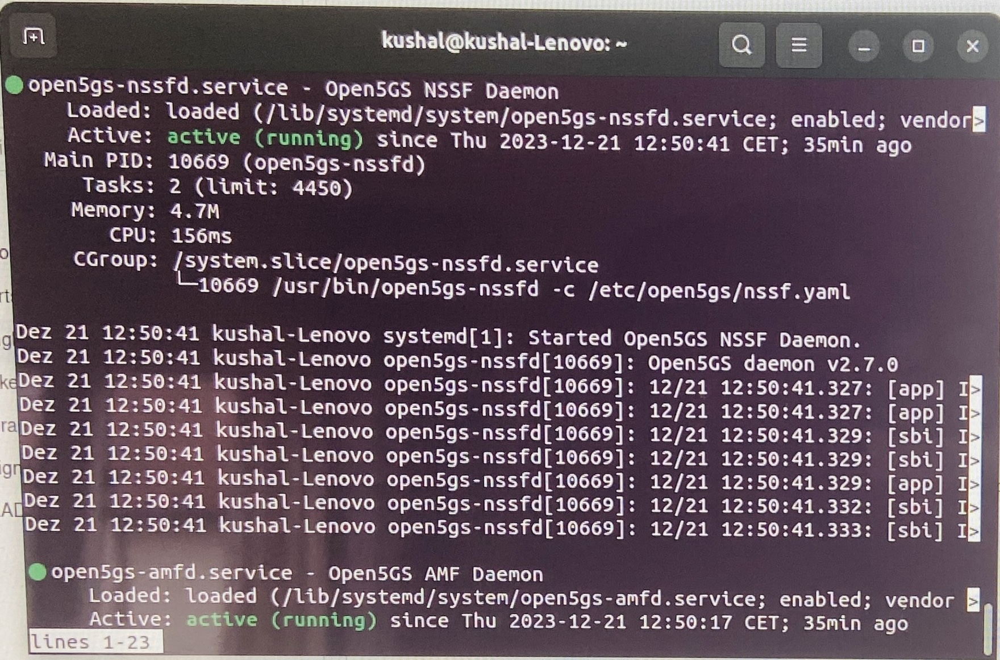
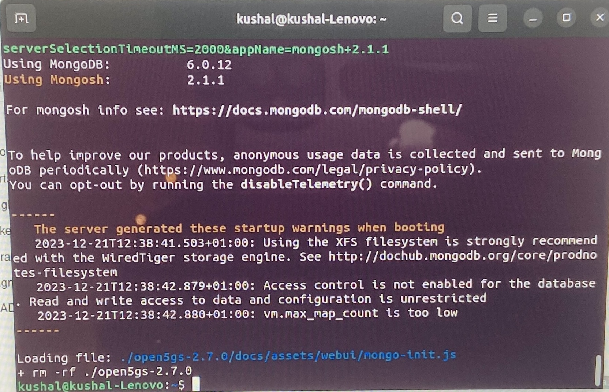
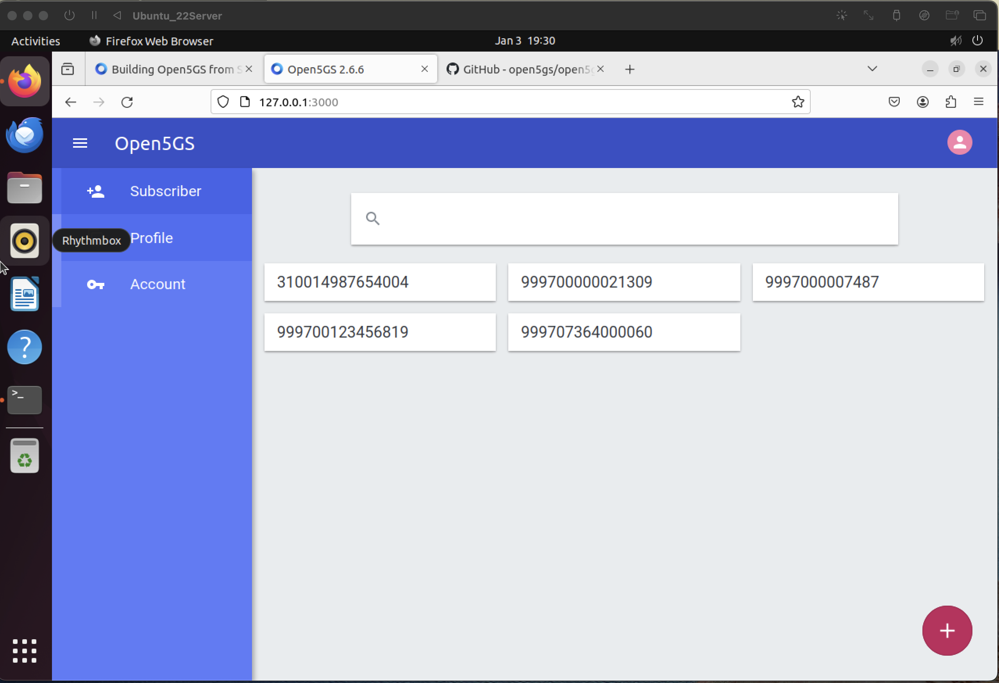

# 5G in detail

Template with examples
<!-- PROJECT LOGO -->

<h1 align="center">team_entropy</h1>

    <strong>Our goal is to realise open5gs network and simulate 5G network and environment</strong>
     
    Comment
     
    Kushal Prakash 1429800 
    Karthik Kothamangala Sreenath 1438341
    Padmini Manjunatha 1427336
    Madhushree Manjunatha Lakshmidevi 1445185

 

## Feature overview

*   [x] **Easy to read** like an article
*   [x] **Feature overview and Contents** for fast orientation
*   [ ] **Visuals** to keep users engaged

## Contents

*   [What is this?](#what-is-this)
*   [When should I use this?](#when-should-i-use-this)
*   [Getting started](#getting-started)
    *   [Requirements](#requirements)
    *   [Install](#install)
    *   [Usage](#usage)
*   [Here is where it's your turn](#here-is-where-its-your-turn)
*   [Don't forget anything](#dont-forget-anything)
    * [Used Technologies](#used-technologies)
    * [Testing](#testing)
    * [Logging](#logging)
*   [Contribute](#contribute)
*   [License](#license)
*   [Sources](#sources)
*   [Conclusion](#conclusion)

## Roles

1. Kushal Prakash - Project planning, project tracking, product owner, developer, reviewer

## Getting Started

## Overview on 5G

5G, or fifth-generation, is the latest standard in mobile telecommunications technology, succeeding 4G/LTE. It represents a significant advancement in terms of speed, capacity, and connectivity, aiming to provide faster and more reliable communication for both consumers and businesses. Key features of 5G include:

Higher Data Rates: 5G offers substantially higher data rates compared to its predecessors, with peak data rates reaching several gigabits per second. This enables faster downloads, improved streaming quality, and enhanced overall network performance.
Low Latency: 5G reduces latency, the time it takes for data to travel from the source to the destination and back, to a few milliseconds. This low latency is crucial for applications that require real-time responsiveness, such as augmented reality (AR), virtual reality (VR), and autonomous vehicles.
Increased Network Capacity: 5G networks can support a significantly higher number of connected devices per square kilometer. This increased capacity is essential for the growing number of Internet of Things (IoT) devices and the expanding digital ecosystem.
Network Slicing: 5G introduces the concept of network slicing, allowing network operators to create virtualized and customized "slices" of the network tailored to specific use cases, such as enhanced mobile broadband, massive machine-type communication, and ultra-reliable low-latency communication.
Massive MIMO (Multiple Input, Multiple Output): 5G utilizes advanced antenna technologies like Massive MIMO, which involves deploying a large number of antennas at base stations to improve spectral efficiency and increase data throughput.
mmWave Spectrum: 5G networks leverage millimeter-wave (mmWave) spectrum, which offers high bandwidth for faster data transfer. However, these higher frequencies have shorter range and can be impacted by obstacles, requiring careful network planning and deployment.
Security Enhancements: 5G incorporates improved security features to protect user data and network integrity. This includes encryption, authentication protocols, and privacy safeguards.
Global Standardization: 5G follows global standards set by organizations like the 3rd Generation Partnership Project (3GPP), ensuring interoperability and compatibility across different vendors and network operators.

### User Equipements (UEs)
The User Equipment in a 5G network refers to the end-user devices such as smartphones, tablets, Internet of Things (IoT) devices, and other gadgets that connect to the 5G infrastructure to access communication services. The UE plays a crucial role in the 5G ecosystem by initiating and maintaining connections with the 5G network. It communicates with the Access and Mobility Management Function for access and mobility management, the Session Management Function for session-related functions, and the User Plane Function for handling user plane functionality. The UE is integral to the realization of the 5G vision, enabling high data rates, low latency, and support for a massive number of connected devices. With advanced capabilities, such as improved antenna technologies and compatibility with diverse spectrum bands, the 5G UE contributes to the overall enhanced connectivity and user experience in the 5G network.

### gNBs
The gNB, or gNodeB, is a fundamental component of the 5G radio access network and serves as the base station that connects User Equipment to the 5G core network. The gNB is responsible for radio transmission and reception, managing the radio resources, and facilitating wireless communication with UEs using advanced technologies such as Massive Multiple Input Multiple Output and beamforming. It plays a key role in providing the increased data rates, low latency, and improved connectivity that characterize 5G networks. The gNB communicates with the 5G core network elements, such as the Access and Mobility Management Function and Session Management Function, to establish and maintain connections. As a critical part of the 5G infrastructure, gNBs contribute to the scalability, flexibility, and efficiency of 5G networks, enabling the support of diverse use cases ranging from enhanced mobile broadband to massive machine-type communication and ultra-reliable low-latency communication.

### Network Functions (NFs)
Network Functions in a 5G architecture refer to the various software components responsible for specific tasks within the network. These functions include entities such as the Access and Mobility Management Function, Session Management Function, User Plane Function, Network Repository Function, Network Slice Selection Function, Authentication Server Function, Unified Data Management, Unified Data Repository, Policy Control Function, and Unified Data Storage Function. Each NF performs a specialized role, such as managing access, handling sessions, routing user plane traffic, authenticating users, storing data, enforcing policies, and supporting network slicing. The orchestration and collaboration of these NFs enable the delivery of high-performance, low-latency, and scalable 5G services across a wide range of applications and use cases, defining the functionality and capabilities of the 5G network architecture.

### Network Slicing
Network Slicing is a pivotal concept in 5G networks, allowing the creation of isolated and customized virtual networks to cater to diverse use cases and application requirements. These virtual networks, known as network slices, are tailored to specific service characteristics, such as enhanced mobile broadband, massive machine-type communication, or ultra-reliable low-latency communication. The Network Slice Selection Function plays a crucial role in selecting and activating the appropriate network slice based on the user's service requirements. Network slices provide a way to efficiently share and optimize network resources, ensuring that each slice operates independently with its own set of configurations and policies. This flexibility enables 5G networks to simultaneously support various services, applications, and industries, fostering innovation and accommodating the diverse connectivity needs of a wide range of users and devices.

### Data Network (DN)
The Data Network in a 5G architecture refers to the part of the network responsible for handling data traffic between the User Equipment and external data networks, including the broader internet. The DN encompasses various components, such as the User Plane Function (UPF) and related functions that manage data transmission, packet routing, and forwarding. The UPF, in particular, plays a key role in the efficient and low-latency transport of user data, supporting the high-speed and high-capacity requirements of 5G networks. The DN is integral to providing enhanced data rates, improved connectivity, and efficient handling of diverse data types, contributing to the overall performance and capabilities of 5G networks in delivering advanced communication services and supporting a wide array of applications.

### Access and Mobility management Function (AMF)
The Access and Mobility Management Function is a critical network function in a 5G architecture responsible for managing access to the network and ensuring seamless mobility for User Equipment. The AMF facilitates the establishment and release of connections, mobility procedures, and authentication processes, playing a pivotal role in the initial network access and subsequent handovers as UEs move within the network. It communicates with the User Equipment (UE) and other network functions, coordinating various access-related functions. The AMF's responsibilities include registration, authentication, and authorization of UEs, as well as tracking their movements to optimize network resources. In 5G, the AMF is central to providing efficient access control and mobility management, contributing to the network's ability to deliver enhanced mobile broadband and support a wide range of applications with diverse connectivity requirements.

### Network Repository Function (NRF)
The Network Repository Function is a key element in a 5G network architecture responsible for maintaining information about available network functions (NFs). The NRF plays a crucial role in network discovery and the dynamic allocation of resources. It assists in the selection and activation of the appropriate Network Slice Selection Function for specific services, ensuring efficient utilization of the network infrastructure. By providing a central repository of information about available NFs, the NRF enhances the scalability and flexibility of 5G networks, enabling the system to adapt to varying service requirements and efficiently manage network resources across diverse use cases. The NRF's ability to dynamically handle information about NFs contributes to the overall intelligence and adaptability of the 5G network architecture.

### Session Management Function (SMF)
The Session Management Function is a critical component within the 5G network architecture that plays a central role in handling session-related functions for User Equipment (UE). The SMF is responsible for the establishment, modification, and termination of sessions, ensuring efficient communication between the UE and the 5G network. It manages the data session, including aspects such as Quality of Service (QoS), policy enforcement, and IP address allocation. The SMF interacts with other network functions, such as the Access and Mobility Management Function and the User Plane Function, to facilitate seamless and optimized session management. By efficiently handling sessions, the SMF contributes to the delivery of high-performance and low-latency services in 5G networks, supporting a wide range of applications and use cases.

### User Plane Function (UPF)
The User Plane Function is a critical component in a 5G network architecture responsible for managing the user plane functionality, handling the routing and forwarding of data packets between the User Equipment and external data networks. The UPF plays a central role in ensuring efficient data transmission, low-latency communication, and high-speed connectivity for 5G services. It facilitates the delivery of user data with optimal performance, supporting the enhanced data rates and responsiveness characteristic of 5G networks. The UPF interacts with other network functions, such as the Session Management Function (SMF) and the Access and Mobility Management Function, to coordinate session-related functions and access management. Its role in efficiently managing the user plane traffic contributes to the overall capability of 5G networks to deliver diverse services with improved network performance.

### Policy Control Function (PCF)
The Policy Control Function is a vital element in the 5G network architecture responsible for enforcing policies related to Quality of Service (QoS) and user plane functionality. The PCF ensures that network resources are allocated and utilized in accordance with predefined policies, enabling efficient management of data traffic and service quality. It plays a crucial role in optimizing network performance by dynamically adjusting policies based on real-time conditions and user requirements. The PCF interacts with various network functions, including the Session Management Function and the Access and Mobility Management Function, to coordinate and enforce policies across the network. Through its policy enforcement capabilities, the PCF contributes to the ability of 5G networks to provide a reliable, responsive, and adaptable platform for a diverse range of applications and services.

### Network Slice Selection Function (NSSF)
The Network Slice Selection Function is a key component in the 5G architecture that plays a pivotal role in the creation and selection of network slices. Network slices are virtualized, isolated segments of the 5G network tailored to specific service requirements. The NSSF is responsible for determining the most suitable network slice based on the user's service needs and mobility patterns. It interacts with other network functions such as the Access and Mobility Management Function, the Policy Control Function (PCF), and the Unified Data Management to gather information and make informed decisions about network slice selection. By dynamically adapting to user demands and application requirements, the NSSF ensures that 5G networks can efficiently support a wide array of services with diverse characteristics, from enhanced mobile broadband to ultra-reliable low-latency communication.

### Unified Data Management (UDM)
The Unified Data Management is a crucial element in the 5G network architecture responsible for managing subscriber-related data. It centralizes and securely stores essential information about users, including authentication credentials, subscription details, and service profiles. The UDM plays a vital role in authenticating users and authorizing their access to network resources, ensuring the security and integrity of the 5G network. It interacts with various network functions, such as the Authentication Server Function and the Session Management Function, to facilitate seamless connectivity and support personalized services. By efficiently managing subscriber data, the UDM contributes to the dynamic and secure operation of 5G networks, enhancing their ability to provide a range of services with diverse requirements.

### Unified Data Repository (UDR)
The Unified Data Repository is a critical component within the 5G network architecture, dedicated to storing and managing user data. Specifically, the UDR focuses on handling dynamic user-related data, such as session-specific information, usage statistics, and contextual data relevant to ongoing connections. It interacts with various network functions, including the Session Management Function (SMF) and the Policy Control Function (PCF), to ensure that user data is efficiently accessed and utilized to support real-time communication services. The UDR plays a pivotal role in facilitating the dynamic nature of 5G networks by securely managing and updating user-related information, contributing to the overall responsiveness, reliability, and adaptability of the network in delivering diverse services and applications.

### Authentication Server Function (AUSF)
The Authentication Server Function is a crucial component in the 5G network architecture responsible for providing authentication services to verify the identity of User Equipment and ensure secure access to the 5G network. The AUSF plays a pivotal role in the initial authentication of UEs, contributing to the establishment of secure connections. It interacts with other network functions, including the Access and Mobility Management Function and the Unified Data Management, to authenticate users and authorize their access to network resources. The AUSF's responsibilities include validating credentials, generating authentication vectors, and ensuring the integrity and security of the authentication process. By enforcing robust authentication mechanisms, the AUSF enhances the overall security posture of 5G networks, safeguarding against unauthorized access and potential security threats.

## Used technologies

To implement and emulate 5G core, we will be using the following tools.
TBD: List will be updated as the project progresses (R: Kushal Prakash)

### 1. Ubuntu desktop 22.04 LTS
Ubuntu is a widely-used open-source Linux distribution known for its user-friendly interface, stability, and strong community support. The edition we use is designed for personal computers with a user-friendly interface and pre-installed applications, and Server. Ubuntu Long-Term Support (LTS) releases offer extended updates for stability. It uses the Debian package management system, and the default desktop environment is GNOME, although users can choose others.

    **Currently I have used Ubuntu 22.03, 22.04 desktop and server versions for both amd64 and arm64 to see the best possible fit as I have faced multiple errors in each of the version during software installations of the required tools.
    Issues seems to be resolved after installing ubuntu on baremetal**

### 2. Open5GS with webui(v2.6.6/v2.7.0)
Open5GS is an open-source implementation of 5G core network elements, developed to support 5G standalone (SA) and non-standalone (NSA) network architectures. It provides a platform for researchers, developers, and operators to experiment with and deploy 5G core network functionalities. 
The web user interface (WebUI) of Open5GS is a graphical interface that provides a user-friendly means to interact with and manage the functionalities of the Open5GS core. Offering a visual representation of the core's components and their operational status, the WebUI allows administrators to monitor and configure various aspects of the 5G core network. It often includes features such as user authentication, network slice management, subscriber and session information, as well as real-time visualization of network elements. The Open5GS WebUI enhances the accessibility of the 5G core, catering to users who prefer a graphical interface for monitoring and configuring network components, contributing to the overall ease of deployment and management of Open5GS-based 5G networks.

** Open5gs installation for version 2.7.0 done, currently configuring the network for single subscriber to run **

** Open5gs webui running after locally building open5gs v2.6.6 and webui v2.7.0. Now subscribers can be added **

### 3. UERANSIM (TBU: Version number)
User Equipment (UE) simulator, commonly referred to as ueransim, is an open-source project designed to simulate a 5G User Equipment (UE). The primary goal of ueransim is to provide a tool for developers, researchers, and operators to test and experiment with 5G network functionalities.

### 4. Vagrant (TBU: Version number)
Vagrant is an open-source tool for building and managing virtualized development environments. It provides a command-line interface (CLI) to create and configure reproducible and shareable development environments. Vagrant is commonly used in software development to ensure that the development environment matches the production environment as closely as possible.

### 5. Wireshark (TBU: Version number)
Wireshark is a widely-used open-source network protocol analyzer that allows users to capture and inspect the data traveling back and forth on a computer network in real-time. It supports various protocols and provides a detailed view of network traffic, helping users troubleshoot network issues, analyze security threats, and understand the communication between devices. Wireshark's user-friendly interface allows both beginners and experienced network professionals to examine packet-level details, apply filters, and visualize network interactions.

### 6. MongoDB (6.04)
MongoDB is a widely used, open-source NoSQL database management system designed for high-performance, scalability, and flexibility in handling unstructured or semi-structured data. It falls under the category of document-oriented databases, storing data in a flexible, JSON-like format called BSON (Binary JSON). Key features of MongoDB include its ability to scale horizontally across distributed systems, automatic sharding for efficient data distribution, and support for dynamic schemas that allow easy modification of data structures. MongoDB is particularly well-suited for applications with evolving or unpredictable data models. It provides a powerful query language and indexing capabilities, making it suitable for a wide range of use cases, from web applications to big data processing. The community edition of MongoDB is open source, while there are enterprise versions with additional features and support provided by MongoDB, Inc.

    **Currently tried using 6.04 and 7.03(latest), while latest work and runs on arm64, I haven't been able to get older versions or newer versions run on amd64**

### 7. NodeJS (v12.22.9)
Node.js is an open-source JavaScript runtime built on the V8 engine, designed for server-side development. Its event-driven, non-blocking I/O model enables efficient handling of concurrent connections, making it ideal for real-time applications. Leveraging the V8 JavaScript engine, Node.js executes JavaScript code outside the browser, allowing developers to use a single language across the entire application stack. The Node Package Manager (NPM) facilitates the easy integration of third-party packages, contributing to a vast ecosystem of reusable modules. With its modular architecture, cross-platform compatibility, and support for frameworks like Express.js, Node.js is widely adopted for building scalable, high-performance web and server applications. Its active community, continuous development, and emphasis on asynchronous operations make it a versatile and popular choice in modern web development.

** NodeJS installation done and is working **

### 8. GitHub
GitHub is a web-based platform for version control and collaboration, serving as a central hub for software development projects. It utilizes Git, a distributed version control system, allowing developers to track changes in their code, collaborate seamlessly, and manage project workflows. GitHub provides a user-friendly interface for hosting repositories, facilitating code sharing, issue tracking, and collaborative development through features like pull requests. Developers can contribute to projects, fork repositories, and explore millions of open-source projects hosted on the platform. GitHub has become a fundamental tool for software development, fostering collaboration among individuals and teams globally, while also serving as a platform for community engagement and innovation in the world of code.

### 9. NPM (10.2.3)
npm (Node Package Manager) is a powerful package manager for JavaScript, primarily used with the Node.js runtime. Integrated seamlessly with Node.js installations, npm facilitates the discovery, installation, and management of software packages, enabling developers to easily share and reuse code modules. It serves as a central repository for open-source JavaScript libraries, tools, and frameworks, allowing developers to streamline project development by efficiently handling dependencies, script execution, and version control. With a vast ecosystem and a straightforward command-line interface, npm has become an integral part of modern web development workflows, promoting collaboration and code sharing across the JavaScript community.

** npm installation done and is working **

For sure mention all the technologies you used. If the technologies age in time you don't forget
they are used and need to be replaced.

### Testing

No tests no sucess. You SHOULD have tests for every project, but do new users know how to run them?

### Logging

Logging is essential. How do you know something went wrong if the computer doesn't tell you? Logs
are the first place to search for bugs. Explain to everybody how you can customize it or used it
in the right way.

## Contribute

Pull requests are welcome. For major changes, please open an issue first to discuss what you would like to change.

Please make sure to update tests as appropriate.

## License
[MIT](https://choosealicense.com/licenses/mit/)

## Sources

1. 	5G : an introduction to the 5th generation mobile networks / Ulrich Trick https://hds.hebis.de/fuas/Record/HEB476048613
2. 	5G for the connected world https://hds.hebis.de/fuas/Record/HEB450285588
3. 	5G technology : 3GPP new radio / edited by Harri Holma and Antti Toskala (Nokia Siemens Networks, Finland), Takehiro Nakamura (5G Laboratories, NTT DOCOMO, Inc., Japan) https://hds.hebis.de/fuas/Record/HEB458457841

[react-markdown][react-markdown] - Project which served as an inspiration for this README

[Blog post templates][blog-post-templates] - Used to structure this template as an easy to read blog post

[About markdown][about-markdown] - Why should you use markdown?

[Markdown Cheat Sheet][markdown-cheatsheet] - Get a fast overview of the syntax

[//]: # "Source definitions"
[react-markdown]: https://github.com/remarkjs/react-markdown "React-markdown project"
[blog-post-templates]: https://backlinko.com/hub/content/blog-post-templates "Backlinko blog post templates"
[about-markdown]: https://www.markdownguide.org/getting-started/ "Introduction to markdown"
[markdown-cheatsheet]: https://www.markdownguide.org/cheat-sheet/ "Markdown Cheat Sheet"

## Conclusion

To summarize..

We have an exhaustive README template with many features. The README is easy to read and navigate like an article.
In our future projects we can use this template to get a great head start in creating a custom README.
