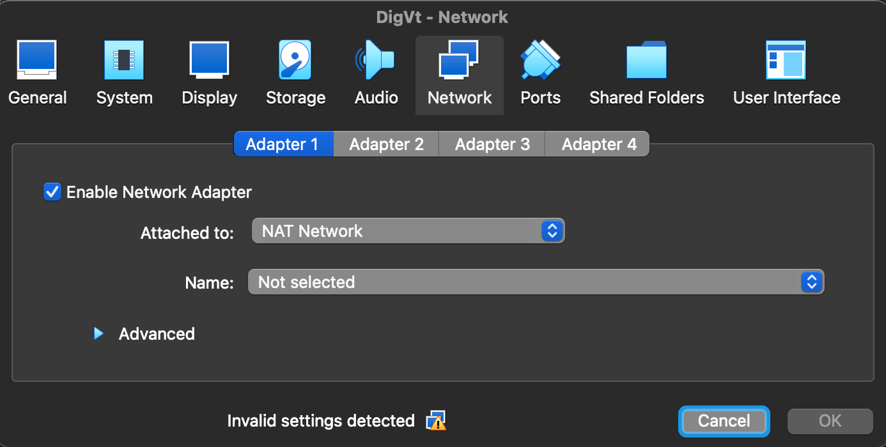
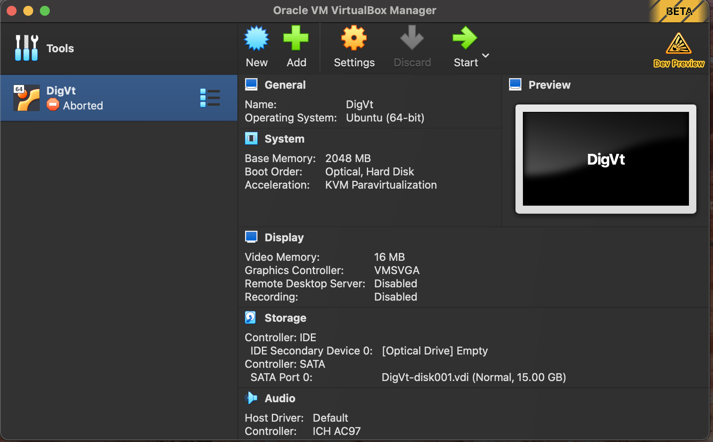
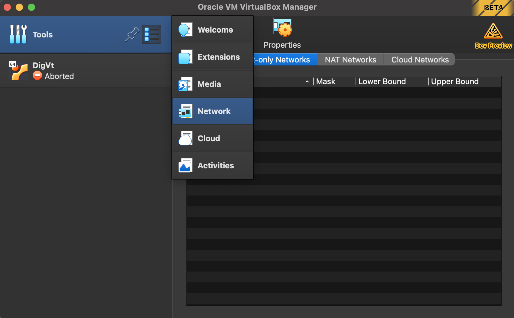
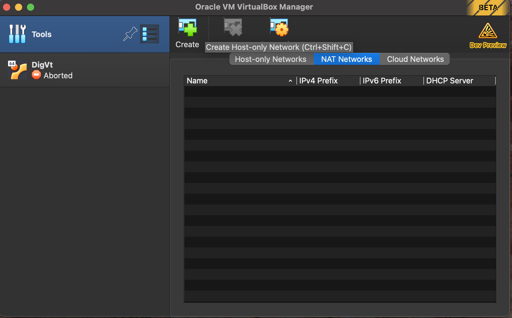
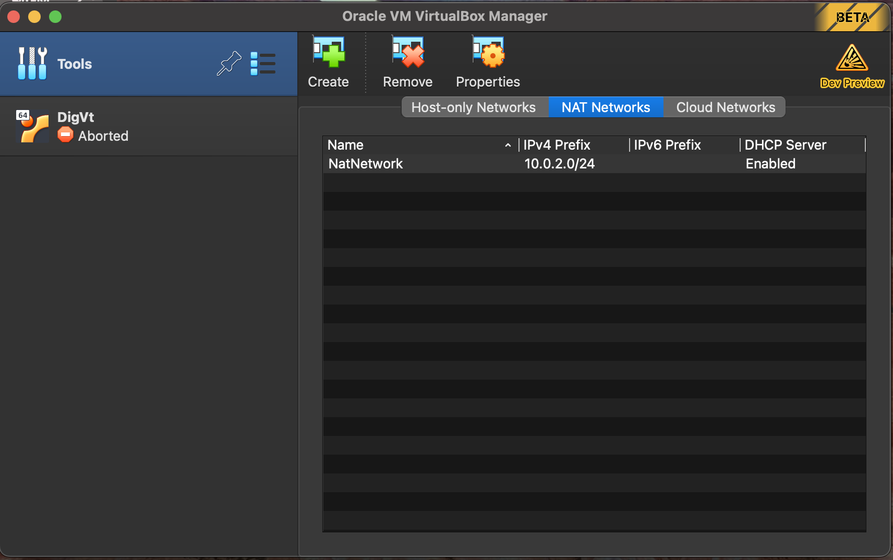
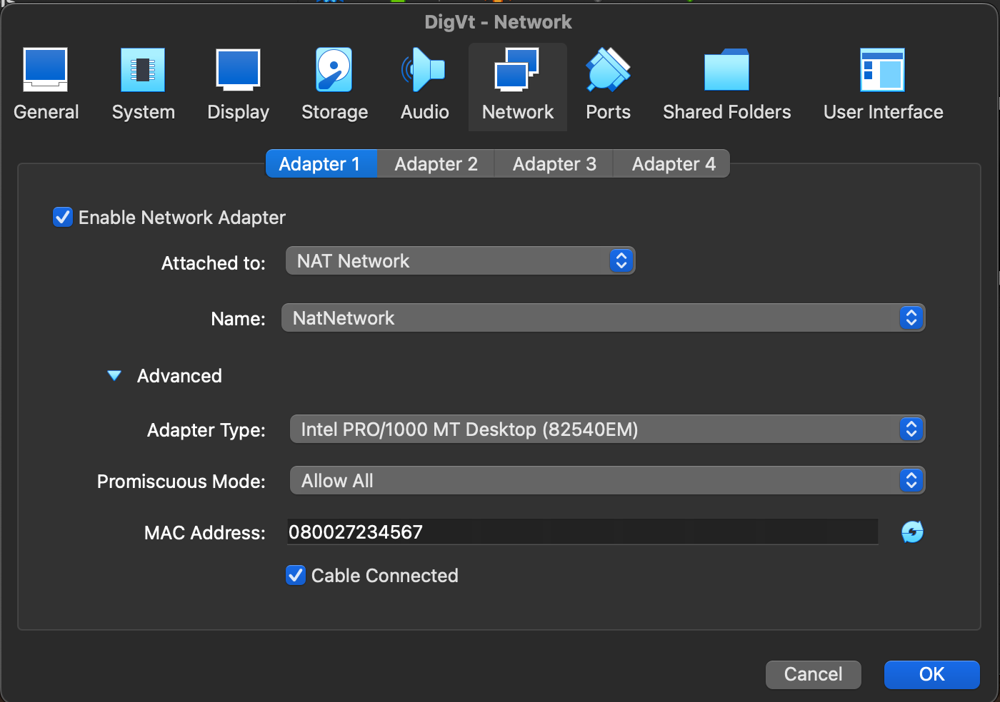

# Creating NAT netowrk for communication between VMs

## Contents

*   [Introduction](#Introduction)
*   [Steps](#Steps)


## Introduction

This section covers on how to create NAT network in oracle VirtualBox. 
When you directly go to network settings for the virtual machine, you will not be able to select NAT network and see the following error. 
We will further discuss on how to resolve this issue and set up NAT network in the same time.



Unlike older versions, in the current versions of virtual box (7.0.14 on Windows and 7.0.8 on MacOS ARM processors) when we go into the network tab of that virtual machine, we do not get the option to select NAT netowrk as an option.

## Steps

Step1: Open VirtualBox



Step2: Go to tools > Network



Step3: Go to NAT tab



Step4: click on create new



Step5: go to the required VM and select enable adapter if not done, then select NAT network and now the name should be available for selecting the NAT network. 
Expand advanced options, under promiscous mode choose Allow All and save it.
Change the MAC address if you wish.



After saving, it should work now, this can be verified by using the following command in the ubuntu VM and check the IP address.

```console

ip addr show

```

