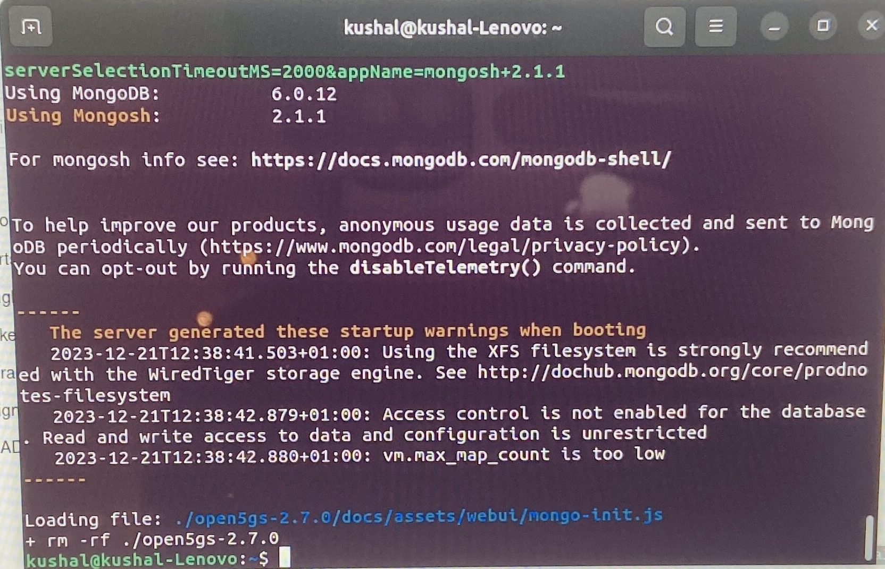

# Installation guide for Open5gs and UERANSIM

## Contents

*   [Introduction](#Introduction)
*   [Downloading and installing UTM](#Downloading-and-installing-UTM:)
*   [Downloading and installing Ubuntu ISO](#Downloading-and-installing-Ubuntu-ISO:)


## Introduction

This guide gives complete steps to install Open5gs on Ubuntu. 
These are the version of softwares used. (Please use the same version for smoother installation)
- Ubuntu 20.04 (AMD64 version)
- Open5gs v2.7.0


*NOTE: Refer to installing Ubuntu for Mac and Windows for respective installation steps.*

Refer to the following link for latest installation steps, if you decide to use the latest version
https://open5gs.org/open5gs/docs/guide/01-quickstart/

If you decide to use different architecture or if you wish to use older versions, you can build the code from the sources. The link is below
https://open5gs.org/open5gs/docs/guide/02-building-open5gs-from-sources/

To choose the version needed, after cloning the stream, do the following

```console
  git clone https://github.com/open5gs/open5gs 
  git checkout v2.6.6 
```  

In this file, we do not focus on building from sources, but on standard installation.

### 0. Install dependencies

```console
     sudo apt install python3-pip python3-setuptools python3-wheel ninja-build build-essential flex bison git cmake libsctp-dev libgnutls28-dev libgcrypt-dev libssl-dev libidn11-dev libmongoc-dev libbson-dev libyaml-dev libnghttp2-dev libmicrohttpd-dev libcurl4-gnutls-dev libnghttp2-dev libtins-dev libtalloc-dev meson 
```     

### 1. Install gnupp packages

```console
  sudo apt update
  sudo apt install gnupg 
``` 
  
### 2. Install MongoDB packages

    MongoDB 4.4 is used in our guide, you can also install latest version on bare metal installation. MongoDB 6.0 was given in the quickstart guide.
    
```console    
     wget -qO - https://www.mongodb.org/static/pgp/server-4.4.asc | sudo apt-key add -
    echo "deb [ arch=amd64,arm64 ] https://repo.mongodb.org/apt/ubuntu bionic/mongodb-org/4.4 multiverse" | sudo tee /etc/apt/sources.list.d/mongodb-org-4.4.list
    sudo apt update
    sudo apt install -y mongodb-org 
```
    
    start the service and check the status
    
```console    
    sudo systemctl start mongod (if '/usr/bin/mongod' is not running)
    sudo systemctl enable --now mongod (ensure to automatically start it on system boot)
    systemctl status mongod 
```   
    
  
    
### 3. Install Open5gs (latest version)
 
```console
    sudo add-apt-repository ppa:open5gs/latest
    sudo apt update
    sudo apt install open5gs   
```   
    
    
  


  
    
### 4. Install WebUI
    
```console
    # Download and import the Nodesource GPG key
    sudo apt update
    sudo apt install -y ca-certificates curl gnupg
    sudo mkdir -p /etc/apt/keyrings
    curl -fsSL https://deb.nodesource.com/gpgkey/nodesource-repo.gpg.key | sudo gpg --dearmor -o /etc/apt/keyrings/nodesource.gpg

    # Create deb repository
    NODE_MAJOR=20
    echo "deb [signed-by=/etc/apt/keyrings/nodesource.gpg] https://deb.nodesource.com/node_$NODE_MAJOR.x nodistro main" | sudo tee /etc/apt/sources.list.d/nodesource.list

    # Run Update and Install
    sudo apt update
    sudo apt install nodejs -y 
    sudo curl -fsSL https://open5gs.org/open5gs/assets/webui/install | sudo -E bash - 
```    
    
  
    
### 5. Start, restart or stop any Open5gs service
        
 To start the NFs –
 ```console
 sudo systemctl start open5gs-mmed
 sudo systemctl start open5gs-sgwcd
 sudo systemctl start open5gs-smfd
 sudo systemctl start open5gs-amfd
 sudo systemctl start open5gs-sgwud
 sudo systemctl start open5gs-upfd
 sudo systemctl start open5gs-hssd
 sudo systemctl start open5gs-pcrfd
 sudo systemctl start open5gs-nrfd
 sudo systemctl start open5gs-scpd
 sudo systemctl start open5gs-ausfd
 sudo systemctl start open5gs-udmd
 sudo systemctl start open5gs-pcfd
 sudo systemctl start open5gs-nssfd
 sudo systemctl start open5gs-bsfd
 sudo systemctl start open5gs-udrd
 sudo systemctl start open5gs-webui
 ```
 
 To restart the NFs –
 ```console
 sudo systemctl restart open5gs-mmed
 sudo systemctl restart open5gs-sgwcd
 sudo systemctl restart open5gs-smfd
 sudo systemctl restart open5gs-amfd
 sudo systemctl restart open5gs-sgwud
 sudo systemctl restart open5gs-upfd
 sudo systemctl restart open5gs-hssd
 sudo systemctl restart open5gs-pcrfd
 sudo systemctl restart open5gs-nrfd
 sudo systemctl restart open5gs-scpd
 sudo systemctl restart open5gs-ausfd
 sudo systemctl restart open5gs-udmd
 sudo systemctl restart open5gs-pcfd
 sudo systemctl restart open5gs-nssfd
 sudo systemctl restart open5gs-bsfd
 sudo systemctl restart open5gs-udrd
 sudo systemctl restart open5gs-webui
 ```
 
 To stop the NFs  -
 ```console
 sudo systemctl stop open5gs-mmed
 sudo systemctl stop open5gs-sgwcd
 sudo systemctl stop open5gs-smfd
 sudo systemctl stop open5gs-amfd
 sudo systemctl stop open5gs-sgwud
 sudo systemctl stop open5gs-upfd
 sudo systemctl stop open5gs-hssd
 sudo systemctl stop open5gs-pcrfd
 sudo systemctl stop open5gs-nrfd
 sudo systemctl stop open5gs-scpd
 sudo systemctl stop open5gs-ausfd
 sudo systemctl stop open5gs-udmd
 sudo systemctl stop open5gs-pcfd
 sudo systemctl stop open5gs-nssfd
 sudo systemctl stop open5gs-bsfd
 sudo systemctl stop open5gs-udrd
 sudo systemctl stop open5gs-webui
 ```

### 6. Check the IP addresses in the system

    You should see ogstun in your list, if not available do the following, this is the IP address of the 5G core.
    
```console    
    sudo ip tuntap add name ogstun mode tun
    sudo ip addr add 10.45.0.1/16 dev ogstun
    sudo ip addr add 2001:db8:cafe::1/48 dev ogstun
    sudo ip link set ogstun up
```
    
    
    ens03 is the machine IP address, note the IPv4 address, this is needed in the next step for configuring other files
    
### 7. Now modify AMF, UPF and SMF. 

    go to /etc/open5gs/ location
    
    Open file amf.yaml and change the ngap server address to local IP address from above 
    
    * Add image*
    
    open file upf.yaml and change gtpu server address to local IP address from above 
    
    * Add image*
    
    SMF needs to be modified for network slicing
    
    * Add image *
    
    After the config changes restart the services
    
```console    
      sudo systemctl restart open5gs-smfd
      sudo systemctl restart open5gs-amfd
      sudo systemctl restart open5gs-upfd 
```      
      
      
### 8. Add subscribers in the WebUI

    Connect to http://localhost:3000 or http://localhost:9999 and login with admin account.

    Username : admin
    Password : 1423      
    
    To add subscriber information, you can do WebUI operations in the following order:

    Go to Subscriber Menu.
    Click + Button to add a new subscriber.
    Fill the IMSI, security context(K, OPc, AMF), and APN of the subscriber.
    Click SAVE Button
    Enter the subscriber details of your SIM cards using this tool, to save the subscriber profile in the HSS and UDR MongoDB database backend. If you are using test SIMs, the details are normally printed on the card.    
    
    These informations are available in open5gs-ue.yaml file of UERANSIM. 
    
    * Add images*


## Installation guide on UERANSIM

## Getting the UERANSIM
Before proceeding, ensure that you have the most recent version of UERANSIM and clone the repository.

```console
  cd ~
  git clone https://github.com/aligungr/UERANSIM
```

## Requirements
1. Ubuntu 20.04.6 or latest version
2. Cmake 3.17 or latest version
3. gcc 9.0.0 or latest version
4. g++ 9.0.0 or latest version

To begin, it is advisable to update your APT repositories and upgrade the installed programs.

```console
  sudo apt update
  sudo apt upgrade
```


## Dependencies
These are the required dependencies to installed.

```console
  sudo apt install make
  sudo apt install gcc
  sudo apt install g++
  sudo apt install libsctp-dev lksctp-tools
  sudo apt install iproute2
  sudo snap install cmake --classic
```


Note: Avoid installing cmake with sudo apt-get install cmake as it may install an older version. Instead, use sudo snap install cmake --classic or build cmake from sources directly.

## Navigate to UERANSIM directory
```console
  cd ~/UERANSIM
```


Note: If the compilation process takes too long, you can speed it up by using make -j instead of make.

## Verify Installation
After successful compilation, the output binaries will be copied to ~/UERANSIM/build folder. You should see the following files:

. nr-gnb: Main executable for 5G gNB (RAN)
. nr-ue: Main executable for 5G UE
. nr-cli: CLI tool for 5G gNB and UE
. nr-binder: Tool for utilizing UE's internet connectivity.
. libdevbnd.so: Dynamic library for nr-binder


 
