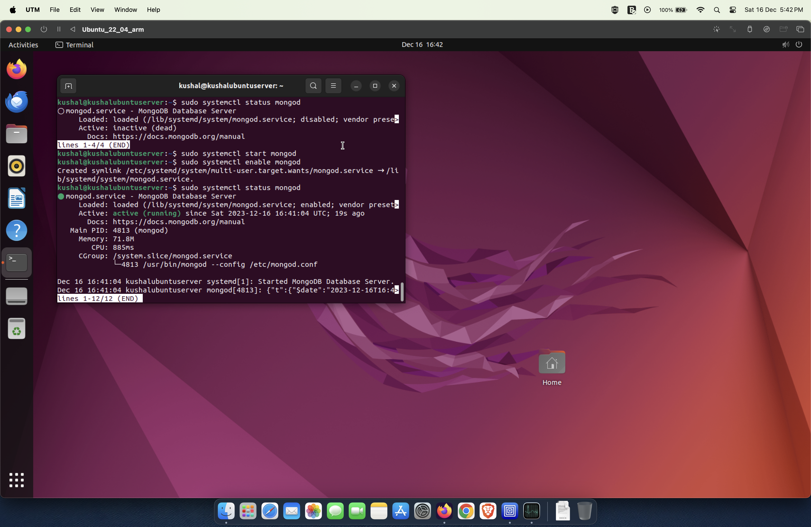

### Technologies Used

To implement and emulate 5G core, we will be using the following tools.

### 1. Ubuntu desktop 22.04 LTS
Ubuntu is a widely-used open-source Linux distribution known for its user-friendly interface, stability, and strong community support. The edition we use is designed for personal computers with a user-friendly interface and pre-installed applications, and Server. Ubuntu Long-Term Support (LTS) releases offer extended updates for stability. It uses the Debian package management system, and the default desktop environment is GNOME, although users can choose others.

### 2. Open5GS with webui(v2.6.6/v2.7.0)
Open5GS is an open-source implementation of 5G core network elements, developed to support 5G standalone (SA) and non-standalone (NSA) network architectures. It provides a platform for researchers, developers, and operators to experiment with and deploy 5G core network functionalities. 
The web user interface (WebUI) of Open5GS is a graphical interface that provides a user-friendly means to interact with and manage the functionalities of the Open5GS core. Offering a visual representation of the core's components and their operational status, the WebUI allows administrators to monitor and configure various aspects of the 5G core network. It often includes features such as user authentication, network slice management, subscriber and session information, as well as real-time visualization of network elements. The Open5GS WebUI enhances the accessibility of the 5G core, catering to users who prefer a graphical interface for monitoring and configuring network components, contributing to the overall ease of deployment and management of Open5GS-based 5G networks.

** Open5gs installation for version 2.7.0 done, currently configuring the network for single subscriber to run **

** Open5gs webui running after locally building open5gs v2.6.6 and webui v2.7.0. Now subscribers can be added **

### 3. UERANSIM
User Equipment (UE) simulator, commonly referred to as ueransim, is an open-source project designed to simulate a 5G User Equipment (UE). The primary goal of ueransim is to provide a tool for developers, researchers, and operators to test and experiment with 5G network functionalities.

### 4. Wireshark
Wireshark is a widely-used open-source network protocol analyzer that allows users to capture and inspect the data traveling back and forth on a computer network in real-time. It supports various protocols and provides a detailed view of network traffic, helping users troubleshoot network issues, analyze security threats, and understand the communication between devices. Wireshark's user-friendly interface allows both beginners and experienced network professionals to examine packet-level details, apply filters, and visualize network interactions.

### 5. MongoDB (6.04)
MongoDB is a widely used, open-source NoSQL database management system designed for high-performance, scalability, and flexibility in handling unstructured or semi-structured data. It falls under the category of document-oriented databases, storing data in a flexible, JSON-like format called BSON (Binary JSON). Key features of MongoDB include its ability to scale horizontally across distributed systems, automatic sharding for efficient data distribution, and support for dynamic schemas that allow easy modification of data structures. MongoDB is particularly well-suited for applications with evolving or unpredictable data models. It provides a powerful query language and indexing capabilities, making it suitable for a wide range of use cases, from web applications to big data processing. The community edition of MongoDB is open source, while there are enterprise versions with additional features and support provided by MongoDB, Inc.

    **Currently tried using 6.04 and 7.03(latest), while latest work and runs on arm64, I haven't been able to get older versions or newer versions run on amd64**

### 6. NodeJS (v12.22.9)
Node.js is an open-source JavaScript runtime built on the V8 engine, designed for server-side development. Its event-driven, non-blocking I/O model enables efficient handling of concurrent connections, making it ideal for real-time applications. Leveraging the V8 JavaScript engine, Node.js executes JavaScript code outside the browser, allowing developers to use a single language across the entire application stack. The Node Package Manager (NPM) facilitates the easy integration of third-party packages, contributing to a vast ecosystem of reusable modules. With its modular architecture, cross-platform compatibility, and support for frameworks like Express.js, Node.js is widely adopted for building scalable, high-performance web and server applications. Its active community, continuous development, and emphasis on asynchronous operations make it a versatile and popular choice in modern web development.

** NodeJS installation done and is working **

### 7. GitHub
GitHub is a web-based platform for version control and collaboration, serving as a central hub for software development projects. It utilizes Git, a distributed version control system, allowing developers to track changes in their code, collaborate seamlessly, and manage project workflows. GitHub provides a user-friendly interface for hosting repositories, facilitating code sharing, issue tracking, and collaborative development through features like pull requests. Developers can contribute to projects, fork repositories, and explore millions of open-source projects hosted on the platform. GitHub has become a fundamental tool for software development, fostering collaboration among individuals and teams globally, while also serving as a platform for community engagement and innovation in the world of code.

### 8. NPM (10.2.3)
npm (Node Package Manager) is a powerful package manager for JavaScript, primarily used with the Node.js runtime. Integrated seamlessly with Node.js installations, npm facilitates the discovery, installation, and management of software packages, enabling developers to easily share and reuse code modules. It serves as a central repository for open-source JavaScript libraries, tools, and frameworks, allowing developers to streamline project development by efficiently handling dependencies, script execution, and version control. With a vast ecosystem and a straightforward command-line interface, npm has become an integral part of modern web development workflows, promoting collaboration and code sharing across the JavaScript community.

### 9. Kamalio
Kamailio is an open-source SIP (Session Initiation Protocol) server, originally known as OpenSER. It is designed to handle large volumes of VoIP (Voice over Internet Protocol) traffic, acting as a proxy, registrar, location server, and load balancer. Kamailio offers flexibility, scalability, and robustness, making it suitable for a wide range of real-time communication applications, including VoIP, instant messaging, presence, and multimedia services. Its modular architecture allows for easy customization and integration with other systems, while its extensive set of features, including routing, authentication, and security mechanisms, make it a popular choice for telecommunications service providers, enterprises, and developers seeking to build reliable and scalable SIP infrastructure.

### 10. NextCloud
Nextcloud is a self-hosted, open-source file synchronization and sharing platform designed to give individuals and organizations control over their data. With features including file storage, collaboration tools, calendar and contact management, video conferencing, and more, Nextcloud offers a comprehensive solution for managing and accessing files and information securely from anywhere. Built with privacy and security in mind, Nextcloud enables users to deploy their own instance on their preferred server infrastructure, ensuring data sovereignty and compliance with regulatory requirements. Its extensible architecture allows for integration with third-party apps and services, making it a versatile platform for personal use, businesses, and educational institutions seeking to enhance productivity and collaboration while maintaining control over their data.

### 11. Owncast and OBS
OwnCast is a self-hosted live streaming platform that allows users to broadcast video content directly from their own servers. It offers a simple setup process and intuitive interface, making it accessible for individuals and small organizations to create their own streaming channels without relying on third-party services. OwnCast prioritizes privacy and control over content, enabling users to manage their streams and viewership according to their preferences. On the other hand, OBS (Open Broadcaster Software) Studio is a free and open-source software for video recording and live streaming. It provides powerful features for capturing and mixing audio and video sources, allowing users to create professional-quality broadcasts. OBS Studio supports various platforms and streaming services, making it a popular choice among content creators, gamers, and professionals for producing live streams, tutorials, podcasts, and other types of multimedia content. While OwnCast focuses on self-hosted streaming, OBS Studio serves as a versatile tool for capturing and broadcasting content across different platforms.

** npm installation done and is working **

For sure mention all the technologies you used. If the technologies age in time you don't forget
they are used and need to be replaced.